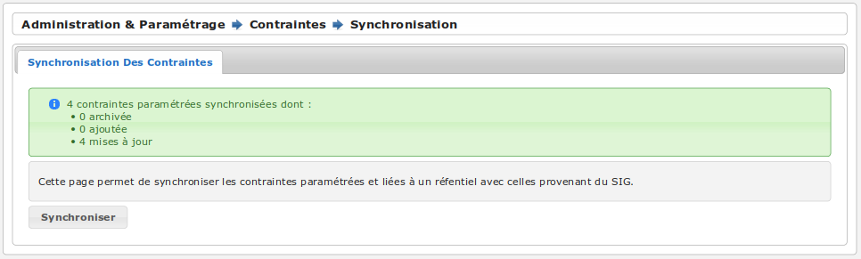
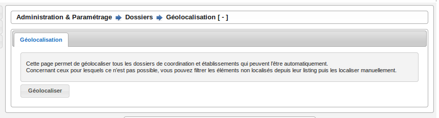
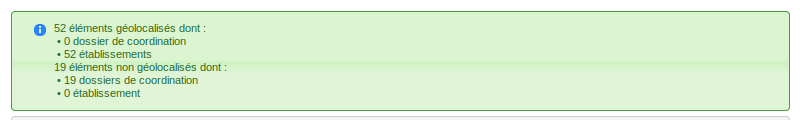

#############################
Administration et paramétrage
#############################

Etablissements
==============

Type
----

Typologie d'un établissement représentant son activité.

Catégories
----------

Liste des catégories d'un établissement représentant sa capacité.

Natures
-------

Liste des natures d'un établissement (ERP Référentiel, ERP non référentiel, Bâtiment non ERP, ...).

Codes :
 

États
-----

Liste des états d'un établissement (Ouvert, Fermé, Non suivi, ...).

Codes :

Statut juridique
----------------

Liste des statuts juridiques d'un établissement (ville, public, privé, ...).

Codes :

Tutelle administrative
----------------------

Liste des tutelles administratives d'un établissement lorsque son statut juridique est 'public' ou du code 'PUB'.

Périodicité de Visite
---------------------

Paramétrage de la périodicité des visites obligatoires à réaliser sur les établissements de nature 'ERP référentiel'.

Adresses
========

Voies
-----

Liste des voies auxquelles sont rattachées les établissements.

Arrondissements
---------------

Liste des arrondissements auxquels sont rattachés les établissements.

Contacts
========

Types
-----

Typologie d'un contact.

Codes :

  - EXPL
  - INST

Civilités
---------

Liste des civilités d'un contact.

Contraintes
===========

Listing
-------

Liste des contraintes paramétrées et destinées à être appliquées aux établissements et dossiers de coordination.
Elles peuvent provenir d'un référentiel SIG (via une synchronisation) ou être ajoutées manuellement.

Les informations spécifiques et facultatives d'une contrainte paramétrée sont :

  - l'ordre d'affichage (permet de classer les contraintes appliquées à un établissement ou un dossier de coordination à l'intérieur des groupes et sous-groupes) ;
  - le texte surchargé (permet d'étendre le texte standard de la contrainte à respecter).

Synchronisation
---------------

L'option SIG doit être activée pour faire apparaître cette rubrique.
Effectuer une synchronisation revient à mettre à jour les contraintes paramétrées selon le référentiel SIG :

  - s'il manque des contraintes dans openARIA elles sont ajoutées ;
  - si des contraintes d'openARIA ne sont plus dans le référentiel elles sont archivées ;
  - si des contraintes d'openARIA sont dans le référentiel elles sont mises à jour.

Seules contraintes paramétrées provenant d'un référentiel sont impactées par la synchronisation : celles ajoutées manuellement ne sont pas concernées.
La synchronisation ne se fait que dans le sens SIG → openARIA : les contraintes présentes sur le référentiel ne sont pas modifiées.

Les informations d'une contrainte récupérée du SIG sont :

  - identifiant dans le référentiel ;
  - nature (POS/PLU/CC/RNU) ;
  - groupe ;
  - sous-groupe ;
  - libellé ;
  - texte.

.. note::

  Lorsque l'on récupère des contraintes pour un établissement ou un dossier de coordination, openARIA est susceptible de demander une synchronisation des contraintes
  dans le cas où les contraintes récupérées depuis le référentiel SIG sont absentes du paramétrage.

Métiers
=======

Services
--------

Liste des services.

Acteurs
-------

Liste des acteurs de l'application représentant les cadres, techniciens et secrétaires affectés à un service. Un acteur peut être rattaché à un utilisateur ou non.

Avis
----

Liste des avis possibles sur un dossier que ce soit en réunion, suite à une visite ou dans une analyse.

Instances
---------

Paramétrage des instances convoquées lors des réunions ou lors des visites ainsi que de leurs membres.

Autorités compétentes
---------------------

Liste des autorités compétentes d'un dossier d'instruction.

Dérogations SCDA
----------------

Liste des dérogations SCDA disponibles depuis les données techniques des établissements.

Réunions
========

Types
-----

Typologie et paramétrage de toutes les informations communes à chaque réunion et qui caractérisent un type de réunion.

Catégories
----------

Liste des catégories de dossiers traitées en réunion.

Autorités de police
===================

Types
-----

Typologie et paramétrage d'une décision d'autorité de police notamment les délais.

Motifs
------

Liste des motifs d'une décision d'autorité de police.

Analyses
========

Types
-----

Typologie et paramétrage des analyses notamment les modèles d'éditions associés.

Essais réalisés
---------------

Textes types disponibles à l'insertion depuis le formulaire de saisie des essais réalisés lors de l'analyse des dossiers d'instruction.

Documents présentés
-------------------

Textes types disponibles à l'insertion depuis le formulaire de saisie des documents présentés lors de l'analyse des dossiers d'instruction.

Réglementations applicables
---------------------------

Textes types disponibles à l'insertion depuis le formulaire de saisie des réglementation applicables lors de l'analyse des dossiers d'instruction.

Prescriptions
-------------

Paramétrage des prescriptions réglementaires et spécifiques utilisées dans les analyses des dossiers d'instruction.

Documents entrants
==================

Types
-----

Typologie d'un document entrant.

Documents générés
=================

Compléments
-----------

Textes types disponibles à l'insertion depuis le formulaire de saisie d'un document généré dans les champs compléments.

Qualités de signataire
----------------------

Liste des qualités d'un signataire.

Signataires
-----------

Paramétrage des signataires disponibles depuis un document généré ou un PV.

Visites
=======

Durées
------

Liste des durées de visite.

Motifs d'annulation
-------------------

Liste des motifs d'annulation d'une visite.

Dossiers
========

Types
-----

Typologie des types de dossiers de coordination (Visites, Plans, ...).

Types de DC
-----------

Typologie et paramétrage des dossiers de coordination (AT, PC, Visite périodque, ...).

.. _administration_geolocalisation:

Éditions
========

Types
-----

Typologie et paramétrage d'un modèle d'édition qui permet de filtrer les modèles d'édition disponibles en fonction du contexte des interfaces.

Catégories
----------

Paramétrage des catégories de types de modèles d'édition. Cette catégorisation permet de définir le contexte dans lequel les types de modèles d'édtion rattachés à cette catégorie vont être disponibles.

Modèles d'édition
-----------------

Paramétrage des modèles d'édition par la sélection de leur type et de la lettre type utilisée.

Lettres types
-------------

Composition des lettres types.

Logos
-----

Paramétrage des logos disponibles depuis l'écran de composition des lettres types.

Sous-états
----------

Paramétrage des tableaux (appelés sous-états) disponibles à l'insertion depuis l'écran de composition des lettres types.

Requêtes
--------

Paramétrage des configurations de champs de fusion disponibles depuis l'écran de composition des lettres types.

Général
=======

Collectivités
-------------

Paramétrage des collectivités.

.. _administration_parametre:

Paramètres
----------

Divers paramètres de l'application : champs de fusion généraux disponibles pour les éditions pdf, activation/désactivation de modules complémentaires, paramétrages fonctionnels, ...

Utilisation des options :

* **option_sig** : la valeur par défaut est *aucun*. Les valeurs possibles sont
  *sig_externe*, *sig_interne* ou *aucun*.

* **option_referentiel_patrimoine** : :ref:`module_interface_avec_le_referentiel_patrimoine`

* **swrod** : :ref:`module_swrod`

Gestion des utilisateurs
========================

Profils
-------

Paramétrage des profils utilisateurs et de toutes les permissions qui y sont associées.

Utilisateurs
------------

Paramétrage des utilisateurs autorisés à se connecter à l'application.

Tableaux de bord
================

Widgets
-------

Paramétrage des blocs d'informations affichables sur le tableau de bord.

Composition
-----------

Composition des tableaux de bord par profil.

Options avancées
================

Géolocalisation
---------------

Si un SIG externe est paramétré, il est possible de géolocaliser l'ensemble des établissements
et des dossiers de coordination, en un seul clic.

Un message de validation fait apparaître le nombre d'éléments qui ont pu être géolocalisés
automatiquement par le SIG, ainsi que le nombre d'éléments qui n'ont pas pu être géolocalisés.
Pour les éléments qui ne sont pas géolocalisables automatiquement (dont les informations
sont inconnues du SIG), il est possible de dessiner manuellement l'élément sur le SIG.
Pour cela, il faut se rendre directement sur :ref:`l'établissement<etablissement_geolocaliser>` ou le :ref:`dossier de coordination<dossiers_dc_geolocaliser>`.

Import
------

Ce module permet l'intégration de données dans l'application depuis des fichiers CSV.

Générateur
----------

Ce module permet la génération d'éléments à partir du modèle de données.

