###################
Rubrique "Dossiers"
###################

.. image:: menu-rubrik-dossiers.png

La rubrique "Dossiers" est divisée en catégories :

- DC (Coordination) : il est possible pour un technicien depuis le DI ou l'établissement d'accéder à des écrans de DC, il a donc été nécessaire d'ajouter une entrée de menu à cet effet, pour qu'elle soit disponible et sélectionnée sur cet écran afin de conserver une navigation cohérente.

- DI (Instruction) : catégorie principale dont les entrées sont sélectionnées lors d'accès aux écran de DI.

- Visites : catégorie nécessaire au listing du widget "mes visites à réaliser"

- Documents entrants : catégorie nécessaire au listing du widget "mes documents entrants non lus"

- Autorité de police : catégorie nécessaire au listing du widget "Autorités de police qui n'ont pas été notifiées ou exécutées"

DC (Dossiers de Coordination)
=============================

Les listings de DC
------------------

Lorsqu'un Système d'Information Géographique est paramétré, chaque ligne des listings de dossiers de coordination contient un icône en forme de Terre. Celui-ci permet d'être redirigé sur le SIG avec la vue centrée sur le dossier de coordination correspondant à cette ligne.

.. _dossiers_dc_a_qualifier:

Dossiers à qualifier
####################

(:menuselection:`Dossiers --> DC (Coordination) --> Dossiers à qualifier`)

Ce listing présente les dossiers de coordination à qualifier par ordre alphabétique du libellé du dc.

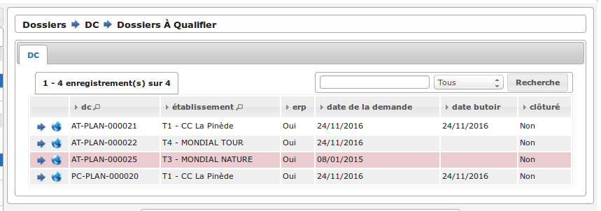

Dans ce listing (comme dans le listing du widget :ref:`widget_dossier_coordination_a_qualifier`), trois couleurs permettent de distinguer les éléments suivants :

- blanc ou gris : un dc dont la date de demande est de moins de 15 jours et sur lequel le marqueur dépôt de pièce n'est pas activé
- vert : un dc dont la date de demande est de moins de 15 jours et sur lequel le marqueur dépôt de pièce est activé
- rouge : un dc dont la date de demande est de plus de 15 jours

L'administrateur peut modifier la limite de 15 jours via l'option **dc_a_qualifier_redlimit** dans :ref:`administration_parametre`.

Tous les dossiers
#################

(:menuselection:`Dossiers --> DC (Coordination) --> Tous les dossiers`)

Ce listing présente tous les dossiers de coordination.

Lorsqu'un Système d'Information Géographique est paramétré, un icône en forme de Terre au-dessus du listing permet d'être redirigé vers le SIG et de consulter la sélection actuelle de dossiers de coordination. S'il n'y a pas eu de recherche avancée, le bouton redirige vers la couche des dossiers de coordination sur le SIG.

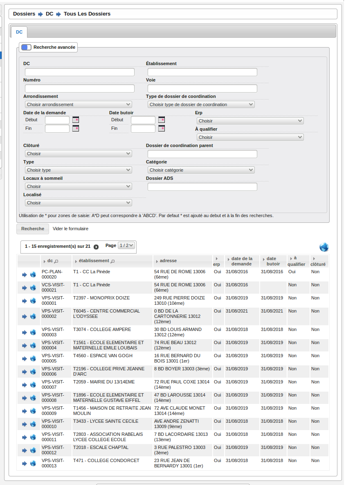

Ajouter un nouveau DC
---------------------

(:menuselection:`Dossiers --> DC (Coordination) --> Nouveau dossier`)

Cette entrée de menu permet d'accéder directement au formulaire d'ajout d'un dossier de coordination.

.. image:: dossier_coordination-form-ajouter.png

Les types de dossier de coordination ont un paramétrage qui permet de remplir automatiquement certains champs du formulaire :

- la case à cocher de la qualification,
- la case à cocher du dossier d'instruction sécurité,
- la case à cocher du dossier d'instruction accessibilité.

La case à cocher "À qualifier" définit si un dossier doit être qualifié ou non.

Lorsqu'un Système d'Information Géographique est paramétré, openARIA va tenter de géolocaliser automatiquement le dossier de coordination lors de sa création. Cette géolocalisation se fait sur la base de l'adresse, des parcelles et du numéro de dossier ADS qui ont été renseignés. 

Si le dossier a été géolocalisé automatiquement sur le SIG grâce aux informations renseignées, le message suivant apparaîtra, en indiquant la précision de la géolocalisation.

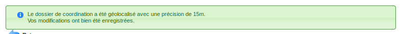

Si le dossier n'a pas pû être géolocalisé automatiquement, le message de validation contient un lien, qui permet à l'utilisateur de dessiner manuellement le dossier de coordination sur le SIG. 

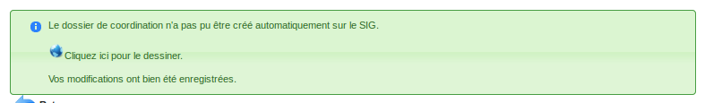

Une fois ce dessin manuel effectué sur le SIG, il faut faut lancer l'action de géolocalisation depuis la fiche du dossier créé pour valider le dessin manuel. En cas de succès, un message de validation apparaîtra, en indiquant la précision de la géolocalisation.

.. image:: dossier_coordination-geolocaliser-success.png

Si le dossier existe déjà sur le SIG, un message indique à l'utilisateur que ce dossier a déjà été géolocalisé.

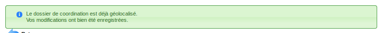

Certains types de dossiers de coordination peuvent ne pas être géolocalisables. Dans ce cas, le message de validation lors de la création du dossier précise que le dossier n'est pas géolocalisable.

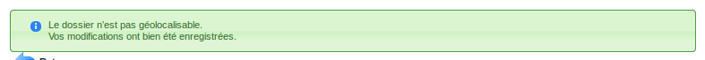

La fiche du dossier de coordination (DC)
----------------------------------------

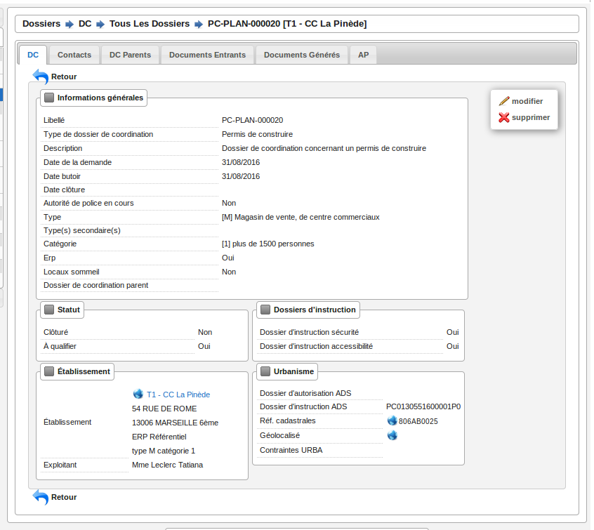

Lorsqu'un Système d'Information Géographique est paramétré, les icônes en forme de Terre présents dans la fiche permettent d'être redirigé sur le SIG avec la vue centrée sur l'élément choisi :

- si le dossier de coordination a été géolocalisé, l'icône dans le champ "Géolocalisé" permet de visualiser le dossier sur le SIG.
- si un établissement est lié au dossier, on peut le visualiser sur le SIG en cliquant sur l'icône à côté du nom de l'établissement.
- si des références cadastrales ont été renseignées, l'icône dans le champ références cadastrales permet de visualiser ces parcelles sur le SIG.

.. _dossiers_dc_enjeu_erp:

Activer/Désactiver l'enjeu ERP
##############################

Cette action permet d'activer/ de désactiver le caractère 'à enjeu ERP' d'un dossier de coordination c'est-à-dire qu'une attention particulière doit y être apportée.

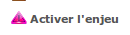

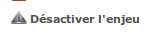

Si l'option est activée et que les critères du déclencheur sont remplis, un message de notification transmet l'information au référentiel ADS (:ref:`echange_erp_ads_207`).

L'information est visible sur la fiche de visualisation du DC :

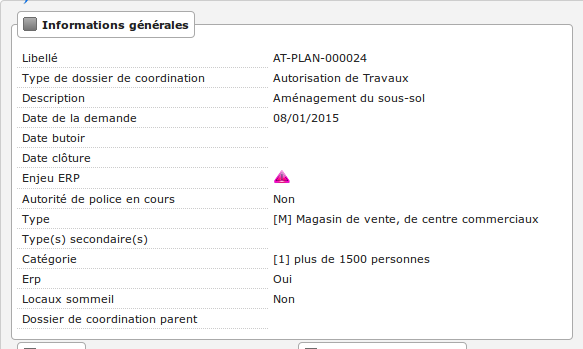

L'information est visible également sur la fiche de visualisation du DI dans le bloc d'informations du dossier de coordination :

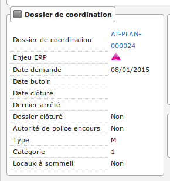

L'information est visible uniquement si le dossier est marqué comme à enjeu ERP sinon l'information n'est pas affichée du tout.

.. _dossiers_dc_connexion_referentiel_ads:

Connexion avec le référentiel ADS
#################################

Dans le contexte du module :ref:`module_interface_avec_le_referentiel_ads`, il est nécessaire d'identifier les dossiers qui sont connectés avec ce référentiel afin d'éviter de transmettre des messages de réponse à des dossiers non initialisés en ce sens. Lorsque  un dossier de coordination est créé dans openARIA suite à la réception d'une notification du référentiel ADS, il est noté comme connecté avec le référentiel ADS. Aucune action ne permet à l'utilisateur de modifier ce marqueur.

L'information est visible sur la fiche de visualisation du DC :

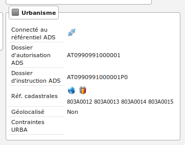

L'information est visible également sur la fiche de visualisation du DI dans le bloc d'informations urabnisme :

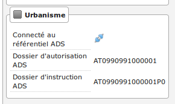

L'information est visible uniquement si le dossier est connecté au référentiel ADS sinon l'information n'est pas affichée du tout.

.. _dossiers_dc_champs_da_di_ads:

Les champs "dossier d'autorisation ADS" et "dossier d'instruction ADS"
######################################################################

Dans le contexte du module :ref:`module_interface_avec_le_referentiel_ads`, le dossier de coordination porte les champs "dossier d'autorisation ADS" et "dossier d'instruction ADS". Ces deux champs ont des comportements différents en fonction du contexte.

Cas d'un DC non connecté au référentiel ADS
,,,,,,,,,,,,,,,,,,,,,,,,,,,,,,,,,,,,,,,,,,,

Ces deux champs sont modifiables par l'utilisateur qui a le droit de modifier le DC. Lors de la validation du formulaire, si l'option 'référentiel ADS' est activée alors on vérifie si les valeurs saisies existent dans le référentiel ADS. Si elles n'existent pas on indique à l'utilisateur que les dossiers n'existent pas. La valeur saisie doit être la référence ADS sans espace.

Cas d'un DC connecté au référentiel ADS
,,,,,,,,,,,,,,,,,,,,,,,,,,,,,,,,,,,,,,,

Ces deux champs sont remplis par le référentiel ADS et non modifiables.

Lien vers openADS sur le champ "dossier d'autorisation ADS"
,,,,,,,,,,,,,,,,,,,,,,,,,,,,,,,,,,,,,,,,,,,,,,,,,,,,,,,,,,,

Si l'option 'référentiel ADS' est activée et qu'une valeur est présente dans le champ "dossier d'autorisation ADS" alors un lien apparaît à côté de la valeur et permet lors du clic sur ce lien d'ouvrir une nouvelle fenêtre vers la fiche du dossier d'autorisation directement dans openADS.

Le lien est disponible sur la fiche de visualisation du DC :

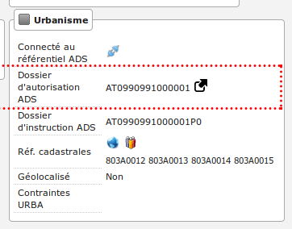

Le lien est disponible également sur la fiche de visualisation du DI :

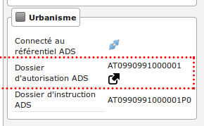

.. _dossiers_dc_geolocaliser:

Géolocaliser un dossier de coordination
#######################################

Si un SIG a été paramétré et que le type du dossier en question est géolocalisable, et si le dossier de coordination n'a pas déjà été géolocalisé, alors une action dans le portail d'actions contextuelles permet de le géolocaliser sur le SIG.

.. image:: dossier_coordination-action-geolocaliser-link.png

Si l'établissement a été géolocalisé automatiquement sur le SIG grâce aux informations renseignées, le message suivant apparaît, en indiquant la précision de la géolocalisation.

.. image:: dossier_coordination-geolocaliser-success.png

Si le dossier de coordination n'a pas pû être géolocalisé automatiquement, un message est affiché, qui contient un lien permettant à l'utilisateur de dessiner manuellement le dossier sur le SIG.

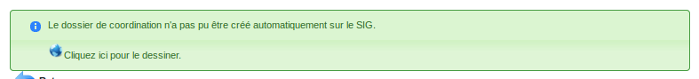

Une fois ce dessin manuel effectué sur le SIG, il faut lancer l'action de géolocalisation depuis la fiche du dossier de coordination créé pour valider le dessin manuel. En cas de succès, un message de validation apparaît, en indiquant la précision de la géolocalisation.

.. image:: dossier_coordination-geolocaliser-success.png

Si le dossier de coordination existe déjà sur le SIG, un message indique à l'utilisateur que celui-ci a déjà été géolocalisé.

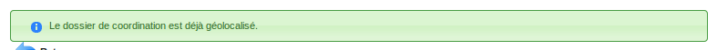

.. _dossier_coordination_recup_proprietaire:

Récupérer les propriétaires de parcelles
########################################

Si un SIG a été paramétré et que les références cadastrales sont renseignées, une action sur le champ des références cadastrales permet de récupérer la liste des propriétaires par parcelles.

L'action ouvre un overlay nommé "Liste des propriétaires".

Si les parcelles renseignées ont un ou plusieurs propriétaires, une liste est présentée à l'utilisateur.

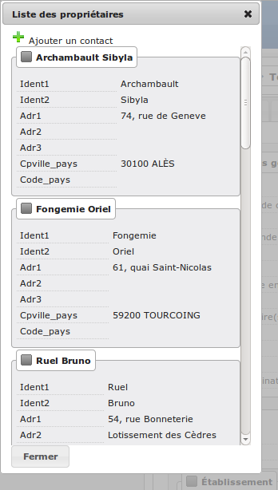

Il se peut que le SIG ne récupère aucun propriétaires.

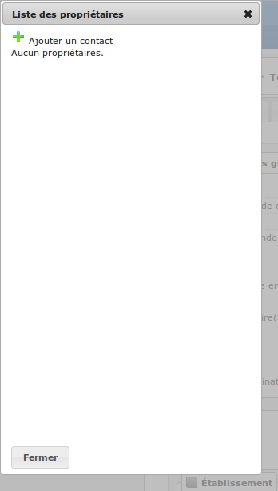

En cas d'erreur de la part du SIG, une erreur est affichée à l'utilisateur.

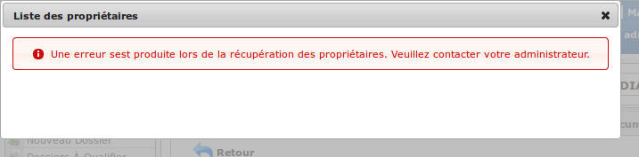

Dans le cas du retour d'aucun ou de plusieurs propriétaires, il est possible d'ajouter un contact sur le dossier de coordination directement depuis cette interface en cliquant sur le bouton d'ajout d'un contact.

.. image:: dossier_coordination-recup-proprietaire-action-ajout-contact-link.png

Le formulaire d'ajout d'un contact apparaît à coté de la liste des propriétaires pour faciliter les copier-coller.

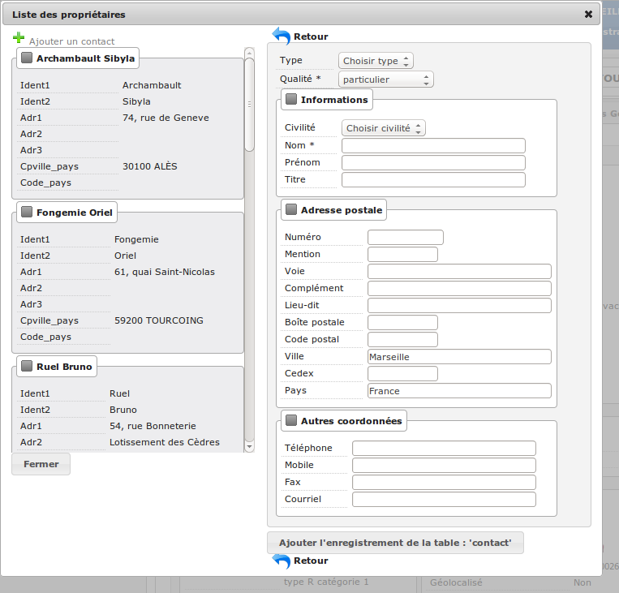

Les boutons de retour permettent de fermer le formulaire d'ajout d'un contact tout en gardant la liste des propriétaires.

.. image:: dossier_coordination-recup-proprietaire-action-retour-contact-link.png

Le bouton de fermeture situé en dessous de la liste des propriétaires permet de fermer la fenêtre entière même si le formulaire d'ajout d'un contact est toujours ouvert.

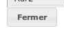

Onglet Contraintes
##################

La fonctionnalité est identique à l':ref:`application des contraintes aux établissements<etablissement_onglet_contraintes>`.

Onglet Contacts
###############

Onglet DC Fils
##############

Cet onglet permet d'afficher tous les dossiers de coordination sur lesquels le dossier de coordination sur lequel on se trouve a été sélectionné comme dossier de coordination parent.

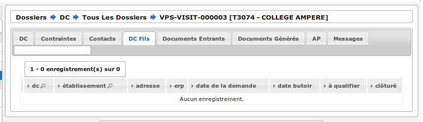

.. _dossiers_dc_onglet_documents_entrants:

Onglet Documents Entrants
#########################

Listing standard (ou interne)
,,,,,,,,,,,,,,,,,,,,,,,,,,,,,

L'onglet "Document Entrants" sur la fiche d'un dossier de coordination affiche tous ses documents entrants liés (ainsi que ceux éventuellement liés aux dossiers d'instruction). Les informations présentées sont :

- le nom du document,
- le type du document (acte, courrier de l'explotant, ...),
- la date de création du document,
- la date de réception du document,
- la date d'émission du document,
- la date butoir du document,
- le statut du document (en cours, qualifié, ...).

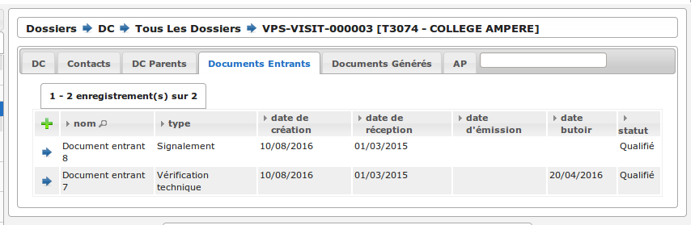

.. _dossiers_dc_onglet_documents_entrants_swrod:

Listing guichet unique
,,,,,,,,,,,,,,,,,,,,,,

Dans le cas où le module :ref:`'swrod' (Documents du guichet unique en lecture seule)<module_swrod>` est activé, l'onglet peut posséder un affichage différent si le DC contient une référence vers un dossier ADS. Dans ce cas, l'onglet 'Interne' présente les mêmes informations et actions que l'onglet 'Documents Entrants' standard et l'onglet 'Guichet Unique' présente une vue en lecture seule des documents concernant le dossier ADS du DC.

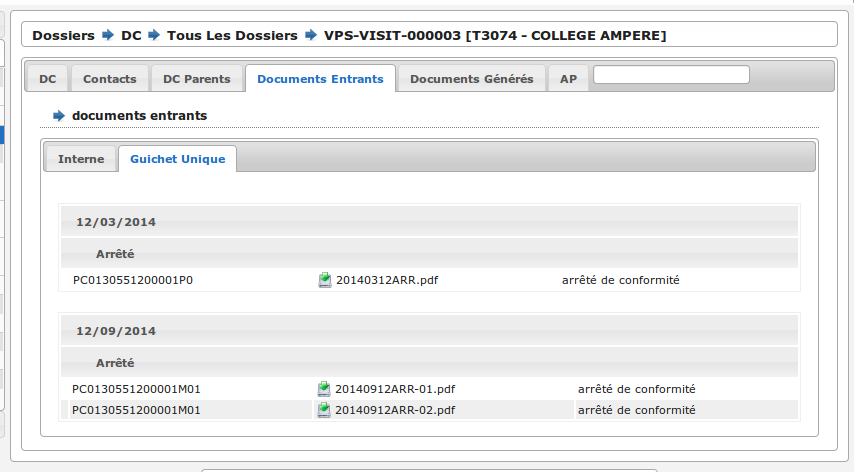

Onglet Documents générés
########################

Onglet AP
#########

L'autorité de police c'est l'autorité du maire, elle n'est pas rattachée directement à un service ou à une Commission. Cependant, le Maire (ou un délégué) se base sur l'avis de la Commission pour prendre une décision d'autorité de Police et pour ce faire il profite des réunions de Commission pour discuter des dossiers en autorité de police.

L'autorité de Police, c'est le pouvoir du Maire qui, en fonction de l'avis d'une commission, demande la mise en règle d'un établissement. Il peut y avoir zéro, une ou plusieurs décisions d'autorité de Police qui sont prises lors d'un passage en commission. Une décision d'autorité de Police est composée principalement de trois informations : une décision, un délai, un motif. Ces décisions d'autorité de police sont liées à un courrier ou à plusieurs courriers permettant de notifier ces décisions. L'autorité de Police se trouve sur le dossier de coordination.

Qualification d'un dossier de coordination
------------------------------------------

La qualification d'un dossier de coordination peut se faire depuis deux écrans, depuis le formulaire d'ajout d'un dossier de coordination ou depuis son formulaire de modification.

Lorsqu'un Système d'Information Géographique est paramétré et que les références cadastrales sont renseignées, il est possible de récupérer la liste des établissements proches géographiquement depuis le champ de liaison avec un établissement.

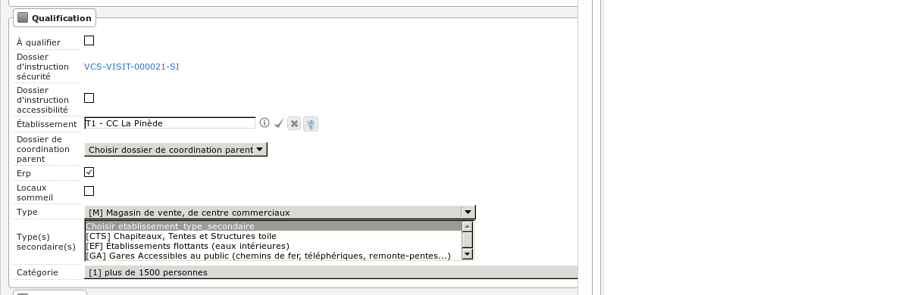

Pour une sélection plus aisée des champs permettent de filtrer la liste des établissements proches :

- le champ **Limite** permet de limiter le total de résultats à 10, 20, 30, 40 ou 50 établissements ;
- le champ **Nature** permet d'afficher seulement les établissements de la nature sélectionnée.

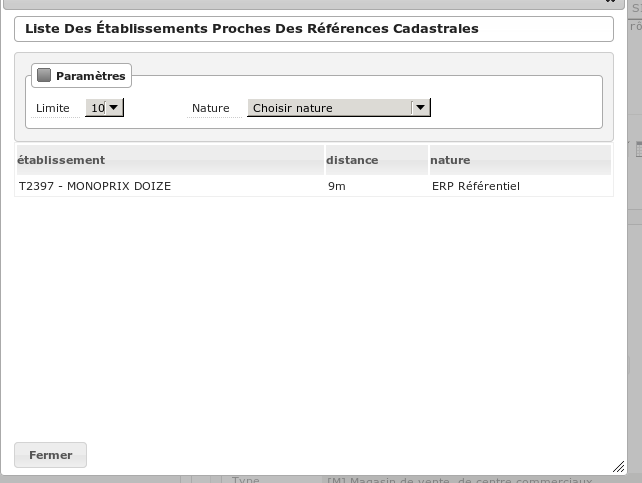

En cliquant sur l'un des établissements celui-ci sera sélectionné pour la liaison avec le dossier de coordination.

Si les références cadastrales du dossier de coordination ne sont pas renseignées, un message d'erreur informe l'utilisateur que celles-ci sont obligatoires pour utiliser cette fonctionnalité.

S'il n'y a aucun établissement proche, alors les champs filtrants sont désactivés et un message indique à l'utilisateur qu'aucun résultat n'est disponible.

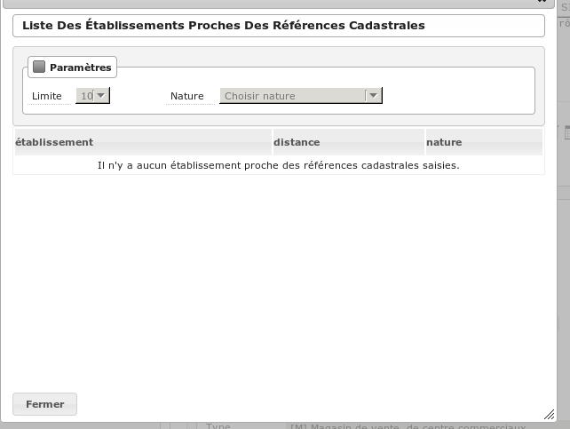

DI (Dossiers d'Instruction)
===========================

Les listing de DI
-----------------

Lorsqu'un Système d'Information Géographique est paramétré, chaque ligne des listings de dossiers d'instruction contient un icône en forme de Terre. Celui-ci permet d'être redirigé sur le SIG avec la vue centrée sur le dossier d'instruction correspondant à cette ligne.

Dossiers à qualifier
####################

(:menuselection:`Dossiers --> DI (Instruction) --> Dossiers à qualifier`)

Dossiers à affecter
###################

(:menuselection:`Dossiers --> DI (Instruction) --> Dossiers à affecter`)

Mes plans
#########

(:menuselection:`Dossiers --> DI (Instruction) --> Mes plans`)

Ce listing présente les dossiers d'instruction dont l'utilisateur connecté est noté comme instructeur et dont le type du dossier de coordination est de type PLAN.

Tous les plans
##############

(:menuselection:`Dossiers --> DI (Instruction) --> Tous les plans`)

Ce listing présente les dossiers d'instruction rattachés au service dont l'utilisateur connecté fait partie et dont le type du dossier de coordination est de type PLAN.

Mes visites
###########

(:menuselection:`Dossiers --> DI (Instruction) --> Mes visites`)

Ce listing présente les dossiers d'instruction dont l'utilisateur connecté est noté comme instructeur et dont le type du dossier de coordination est de type VISIT.

Toutes les visites
##################

(:menuselection:`Dossiers --> DI (Instruction) --> Toutes les visites`)

Ce listing présente les dossiers d'instruction rattachés au service dont l'utilisateur connecté fait partie et dont le type du dossier de coordination est de type VISIT.

Tous les dossiers
#################

(:menuselection:`Dossiers --> DI (Instruction) --> Tous les dossiers`)

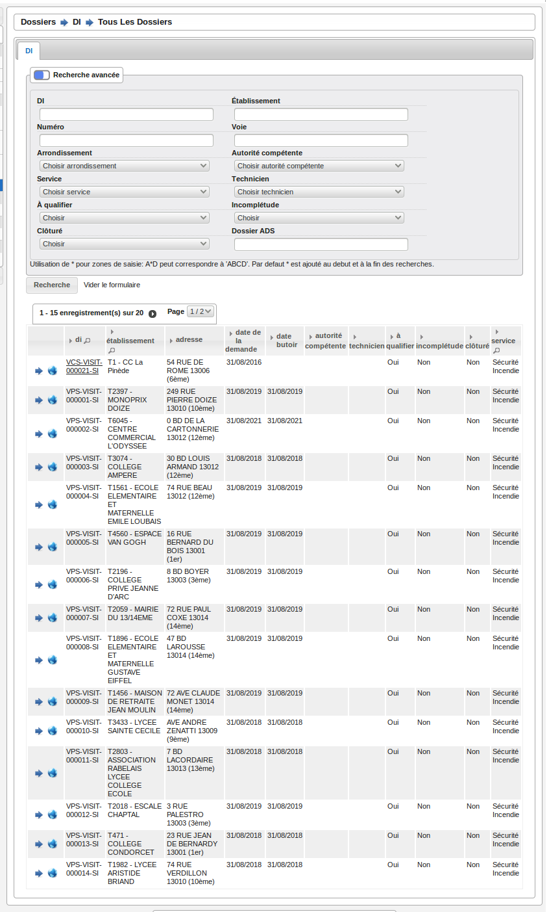

La fiche du dossier d'instruction (DI)
--------------------------------------

Lorsqu'un Système d'Information Géographique est paramétré et que le dossier de coordination lié à ce dossier d'instruction a été géolocalisé, l'icône en forme de Terre permet d'être redirigé sur le SIG avec la vue centrée sur le dossier de coordination lié.

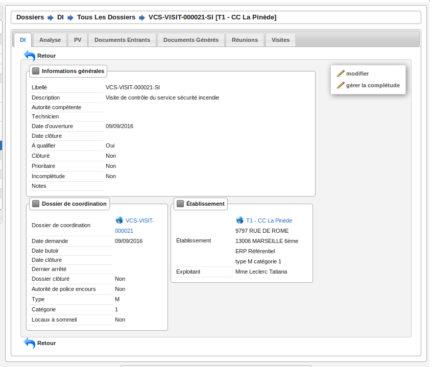

Actions
#######

+ Modifier
    - Disponible si le DI n'est pas clôturé.
    - Ouvre le formulaire de modification du dossier d'instruction.

+ Clôturer
    - Disponible si le DI n'est pas clôturé, n'est pas à qualifier et, dans le cas d'un dossier de coordination périodique, s'il possède une visite.
    - Clôture le dossier d'instruction.

+ Rouvrir
    - Disponible si le DI est clôturé, n'est pas à qualifier et, dans le cas d'un dossier de coordination périodique, si ce dernier n'est pas clôturé.
    - Rouvre le dossier d'instruction.

+ À poursuivre
    - Disponible si le DI n'est pas clôturé, si son statut est "à programmer" ou "programmé" et s'il y a au moins une visite planifiée.
    - Change le statut du dossier d'instruction en "à poursuivre".

+ À programmer
    - Disponible si le DI n'est pas clôturé, si son statut est "programmé" et s'il n'y a aucune visite ou qu'elles sont toutes annulées.
    - Change le statut du dossier d'instruction en "à programmer".

+ Programmer
    - Disponible si le DI n'est pas clôturé, si son statut est "à programmer" ou "à poursuivre" et s'il y a au moins une visite planifiée.
    - Change le statut du dossier d'instruction en "programmé".

Onglet Analyse
##############

Dans le coin haut gauche de la fiche d'analyse figure son état : en cours de
rédaction, terminée, validée ou actée.

Dans le coin haut droit sont disponibles les actions que l'on peut effectuer
dessus : changer son état et éditer un document (rapport, compte-rendu et
prévisualisation de procès-verbal).

Le corps de l'analyse est composé de plusieurs blocs de données qui ont chacun
un titre et éventuellement un bouton modifier (cela dépend de vos droits et de
l'état de l'analyse) :

+ Type de l'analyse
+ Objet
+ Descriptif de l'établissement
+ Classification de l'établissement
+ Données techniques
+ Réglementation applicable
+ Prescriptions
+ Documents présentés lors des visites et ceux fournis après ces dernières
+ Essais réalisés
+ Compte-rendu d'analyse
+ Observation
+ Avis proposé
+ Proposition de décision autorité de police

Onglet PV
#########

Cet onglet permet de gérer les procès verbaux du dossier d'instruction.

Listing
,,,,,,,

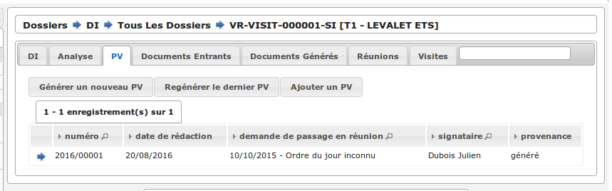

Les différentes actions possibles sont : de lister les procès verbaux existants,
d'accéder aux différents procès verbaux existants, de générer un nouveau procès
verbal, de regénérer le dernier procès verbal, d'ajouter un nouveau procès
verbal tiers.

Générer un nouveau PV
,,,,,,,,,,,,,,,,,,,,,

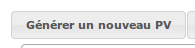

L'analyse du DI doit être validée pour que l'action soit disponible. Le numéro
est défini automatiquement selon l'année de la date de rédaction et récupère un
numéro en fonction du service. Exemple : 2014/00012). L'état de l'analyse
devient "actée". On peut par la suite ajouter au PV généré sa version signée.

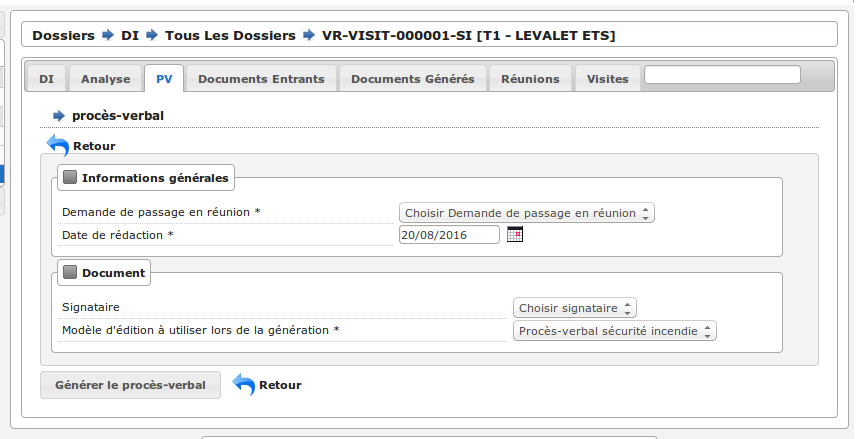

Fiche d'un PV généré
,,,,,,,,,,,,,,,,,,,,

On ne peut pas modifier ce PV. Il est possible de le ré-générer si c'est le
dernier procès-verbal (en conservant le même numéro de PV). Cette modification
nécessite au préalable l'action « ré-ouvrir » sur l'analyse, la modification
des éléments à corriger, puis l'action « terminer » sur l'analyse, et enfin
l'action « valider » sur l'analyse.

L'unique action disponible sur cet élément est l'ajout du PV signé numérisé. 

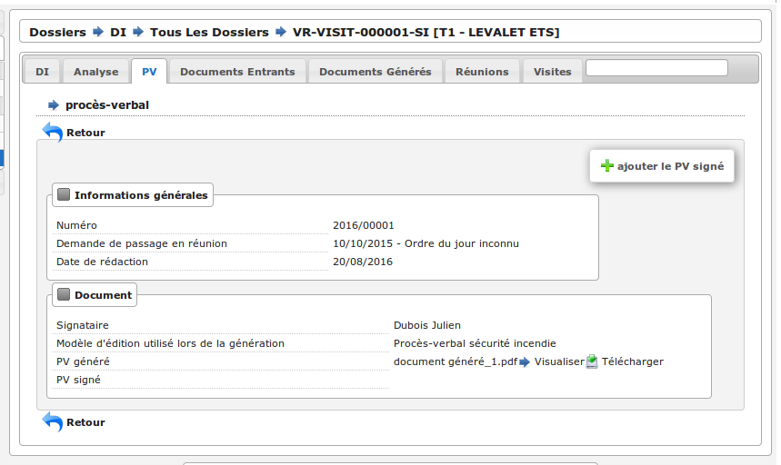

Regénérer le dernier PV
,,,,,,,,,,,,,,,,,,,,,,,

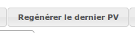

Si l'analyse est rouverte puis revalidée, et qu'au moins un PV a déjà été généré,
alors il devient possible de regénérer le dernier. Pour le reste le comportement
est semblable à un PV généré.

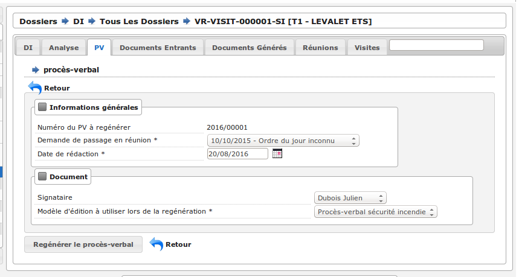

Ajouter un PV
,,,,,,,,,,,,,,

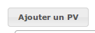

Permet d'ajouter directement un PV tiers (supposé signé). Aucun numéro de PV
n'est défini. 

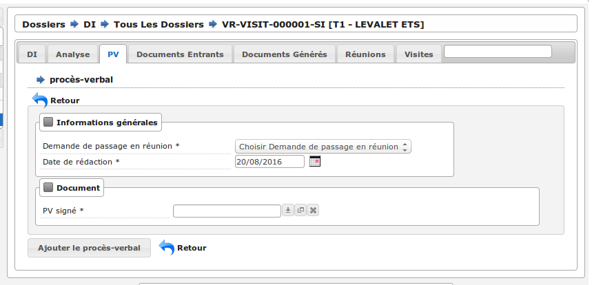

Fiche d'un PV ajouté
,,,,,,,,,,,,,,,,,,,,

On peut modifier ce procès-verbal.

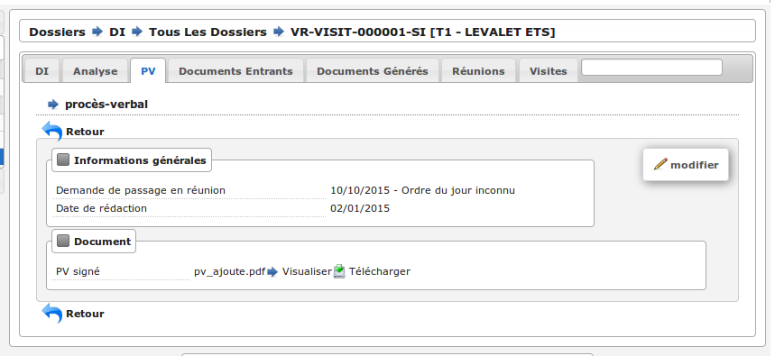

Mise à jour des informations de l'établissement
,,,,,,,,,,,,,,,,,,,,,,,,,,,,,,,,,,,,,,,,,,,,,,,

Dans tous les cas s'il s'agit d'un dossier d'instruction du service Sécurité Incendie et que l'on ajoute un PV signé, tiers ou relatif au PV (re)généré, cela met à jour les données techniques de l'établissement selon celles définies dans l'analyse.

Mise à jour des propositions d'avis de l'analyse
,,,,,,,,,,,,,,,,,,,,,,,,,,,,,,,,,,,,,,,,,,,,,,,,

De plus et ce quelque soit le service, toute action sur un PV (création, modification) met à jour le couple de champs « proposition d'avis » et « proposition de complément d'avis » de la demande de passage liée grâce au couple de champs « proposition d'avis » et « proposition de complément d'avis » de l'analyse du dossier d'instruction sur lequel on se trouve.

Pour le bon fonctionnement de la proposition d'avis dans les réunions de commission
aussi bien pour les dossiers de visites que de plans, le mécanisme suivant est
nécessaire : la création ou modification de ce procès-verbal déclenche la mise à jour du
couple de champs « proposition d'avis » et « proposition de complément d'avis » de la
demande de passage liée grâce au couple de champs « proposition d'avis » et
« proposition de complément d'avis » de l'analyse du dossier d'instruction sur lequel on
se trouve. Si lors de l'impression de l'ordre du jour de la réunion de commission, il s'avère
que le champ « proposition d'avis » n'est pas rempli dans la demande de passage, alors
c'est la valeur de ce même champ dans l'analyse qui sera affiché dans l'ordre du jour.

.. _dossiers_di_onglet_documents_entrants:

Onglet Documents Entrants
#########################

Listing standard (ou interne)
,,,,,,,,,,,,,,,,,,,,,,,,,,,,,

L'onglet "Document Entrants" sur la fiche d'un dossier d'instruction affiche tous ses documents entrants liés. Les informations présentées sont :

- le nom du document,
- l'établissement,
- le dossier de coordination,
- le dossier d'instruction,
- la date butoir du document,
- le statut du document (en cours, qualifié, ...).

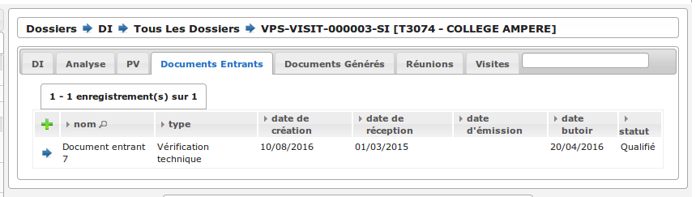

Listing guichet unique
,,,,,,,,,,,,,,,,,,,,,,

.. _dossiers_di_onglet_documents_entrants_swrod:

Dans le cas où le module :ref:`'swrod' (Documents du guichet unique en lecture seule)<module_swrod>` est activé, l'onglet peut posséder un affichage différent si le DC contient une référence vers un dossier ADS. Dans ce cas, l'onglet 'Interne' présente les mêmes informations et actions que l'onglet 'Documents Entrants' standard et l'onglet 'Guichet Unique' présente une vue en lecture seule des documents concernant le dossier ADS du DC.

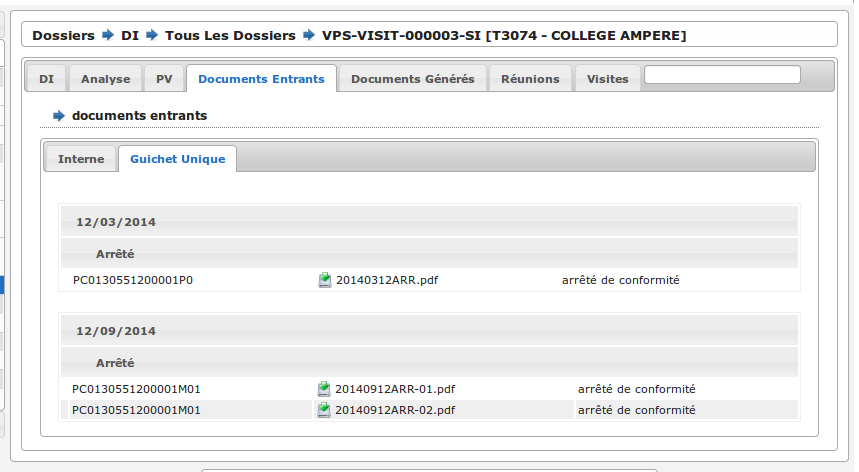

Onglet Documents générés
########################

Onglet Réunions
###############

Onglet Visites
##############

