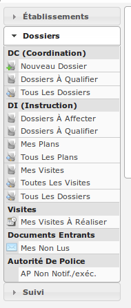
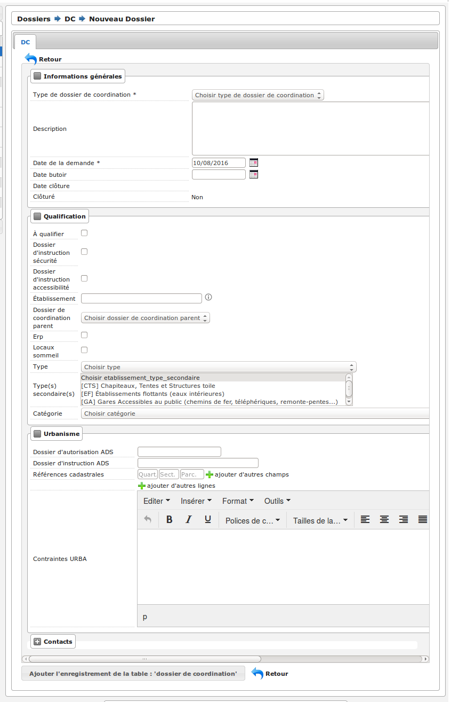

###################
Rubrique "Dossiers"
###################

La rubrique "Dossiers" est divisée en catégories :

- DC (Coordination) : il est possible pour un technicien depuis le DI ou l'établissement d'accéder à des écrans de DC, il a donc été nécessaire d'ajouter une entrée de menu à cet effet, pour qu'elle soit disponible et sélectionnée sur cet écran afin de conserver une navigation cohérente.

- DI (Instruction) : catégorie principale dont les entrées sont sélectionnées lors d'accès aux écran de DI.

- Visites : catégorie nécessaire au listing du widget "mes visites à réaliser"

- Documents entrants : catégorie nécessaire au listing du widget "mes documents entrants non lus"

- Autorité de police : catégorie nécessaire au listing du widget "Autorités de police qui n'ont pas été notifiées ou exécutées"

DC (Dossiers de Coordination)
=============================

Les listing de DC
-----------------

Dossiers à qualifier
####################

(:menuselection:`Dossiers --> DC (Coordination) --> Dossiers à qualifier`)

Ce listing présente les dossiers de coordination à qualifier.

Tous les dossiers
#################

(:menuselection:`Dossiers --> DC (Coordination) --> Tous les dossiers`)

Ce listing présente tous les dossiers de coordination.

Ajouter un nouveau DC
---------------------

(:menuselection:`Dossiers --> DC (Coordination) --> Nouveau dossier`)

Cette entrée de menu permet d'accéder directement au formulaire d'ajout d'un dossier de coordination.

Les types de dossier de coordination ont un paramétrage qui permet de remplir automatiquement certains champs du formulaire :

- la case à cocher de la qualification,
- la case à cocher du dossier d'instruction sécurité,
- la case à cocher du dossier d'instruction accessibilité.

La case à cocher "À qualifier" définit si un dossier doit être qualifié ou non.

La fiche du dossier de coordination (DC)
----------------------------------------

Onglet DC Parents
#################

Onglet Documents entrants
#########################

Onglet Documents générés
########################

Onglet AP
#########

DI (Dossiers d'Instruction)
===========================

Les listing de DI
-----------------

Dossiers à qualifier
####################

(:menuselection:`Dossiers --> DI (Instruction) --> Dossiers à qualifier`)

Dossiers à affecter
###################

(:menuselection:`Dossiers --> DI (Instruction) --> Dossiers à affecter`)

Mes plans
#########

(:menuselection:`Dossiers --> DI (Instruction) --> Mes plans`)

Ce listing présente les dossiers d'instruction dont l'utilisateur connecté est noté comme instructeur et dont le type du dossier de coordination est de type PLAN.

Tous les plans
##############

(:menuselection:`Dossiers --> DI (Instruction) --> Tous les plans`)

Ce listing présente les dossiers d'instruction rattachés au service dont l'utilisateur connecté fait partie et dont le type du dossier de coordination est de type PLAN.

Mes visites
###########

(:menuselection:`Dossiers --> DI (Instruction) --> Mes visites`)

Ce listing présente les dossiers d'instruction dont l'utilisateur connecté est noté comme instructeur et dont le type du dossier de coordination est de type VISIT.

Toutes les visites
##################

(:menuselection:`Dossiers --> DI (Instruction) --> Toutes les visites`)

Ce listing présente les dossiers d'instruction rattachés au service dont l'utilisateur connecté fait partie et dont le type du dossier de coordination est de type VISIT.

Tous les dossiers
#################

(:menuselection:`Dossiers --> DI (Instruction) --> Tous les dossiers`)

La fiche du dossier d'instruction (DI)
--------------------------------------

Actions
#######

+ Modifier
    - Disponible si le DI n'est pas clôturé.
    - Ouvre le formulaire de modification du dossier d'instruction.

+ Clôturer
    - Disponible si le DI n'est pas clôturé, n'est pas à qualifier et, dans le cas d'un dossier de coordination périodique, s'il possède une visite.
    - Clôture le dossier d'instruction.

+ Rouvrir
    - Disponible si le DI est clôturé, n'est pas à qualifier et, dans le cas d'un dossier de coordination périodique, si ce dernier n'est pas clôturé.
    - Rouvre le dossier d'instruction.

+ À poursuivre
    - Disponible si le DI n'est pas clôturé, si son statut est "à programmer" ou "programmé" et s'il y a au moins une visite planifiée.
    - Change le statut du dossier d'instruction en "à poursuivre".

+ À programmer
    - Disponible si le DI n'est pas clôturé, si son statut est "programmé" et s'il n'y a aucune visite ou qu'elles sont toutes annulées.
    - Change le statut du dossier d'instruction en "à programmer".

+ Programmer
    - Disponible si le DI n'est pas clôturé, si son statut est "à programmer" ou "à poursuivre" et s'il y a au moins une visite planifiée.
    - Change le statut du dossier d'instruction en "programmé".

Onglet Analyse
##############

Dans le coin haut gauche de la fiche d'analyse figure son état : en cours de
rédaction, terminée, validée ou actée.

Dans le coin haut droit sont disponibles les actions que l'on peut effectuer
dessus : changer son état et éditer un document (rapport, compte-rendu et
prévisualisation de procès-verbal).

Le corps de l'analyse est composé de plusieurs blocs de données qui ont chacun
un titre et éventuellement un bouton modifier (cela dépend de vos droits et de
l'état de l'analyse) :

+ Type de l'analyse
+ Objet
+ Descriptif de l'établissement
+ Classification de l'établissement
+ Données techniques
+ Réglementation applicable
+ Prescriptions
+ Documents présentés lors des visites et ceux fournis après ces dernières
+ Essais réalisés
+ Compte-rendu d'analyse
+ Observation
+ Avis proposé
+ Proposition de décision autorité de police

Onglet PV
#########

En plus de lister et de permettre d'accéder aux procès-verbaux rattachés au
dossier d'instruction, cet onglet permet d'en ajouter de trois manières :

+ en générant un PV, pour ce faire l'analyse du DI doit être validée

Le numéro est défini automatiquement selon l'année de la date de rédaction.
L'état de l'analyse devient "actée". On peut par la suite ajouter au PV généré
sa version signée.

+ en regénérant le dernier PV

Si l'analyse est rouverte puis revalidée, et qu'au moins un PV a déjà été généré,
alors il devient possible de regénérer le dernier. Pour le reste le comportement
est semblable à un PV généré.

+ en ajoutant directement un PV tiers.

Aucun numéro n'est défini. On peut modifier ce procès-verbal par la suite.

Dans tous les cas s'il s'agit d'un dossier d'instruction du service Sécurité
Incendie et que l'on ajoute un PV signé, tiers ou relatif au PV (re)généré, cela
met à jour les données techniques de l'établissement selon celles définies dans
l'analyse. De plus et ce quelque soit le service, toute action sur un PV
(création, modification) met à jour le couple de champs « proposition d'avis »
et « proposition de complément d'avis » de la demande de passage liée grâce au
couple de champs « proposition d'avis » et « proposition de complément d'avis »
de l'analyse du dossier d'instruction sur lequel on se trouve.

Onglet Documents entrants
#########################

Onglet Documents générés
########################

Onglet Réunions
###############

Onglet Visites
##############

