#########
Ergonomie
#########

Tableau de bord
===============

Le tableau de bord est composé de plusieurs blocs d'informations appelés widget qui permettent à l'utilisateur de visualiser rapidement des informations transverses.

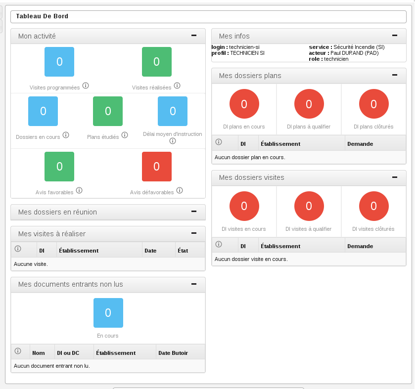

La disposition des widgets est propre à chaque profil et peut être modifiée très facilement par l'administrateur. Il est donc possible pour les services de modifier la disposition (suppression de widget / déplacement de widget) pour le profil technicien de son service.

Pour conserver une cohérence dans la navigation et un comportement identique dans tous les cas de figure, tous les liens du tableau de bord qui pointent vers un élément pointent vers la fiche de visualisation du dossier d'instruction qui est le cœur de travail du technicien. Les liens qui pointent vers un listing pointent vers un listing accessible également depuis le menu.

Widgets
-------

Widget "Activité du service"
############################

.. image:: widget_activite_service.png

L'objet de ce widget est de présenter les statistiques du service de l'utilisateur.

Widget "Analyses à acter"
#########################

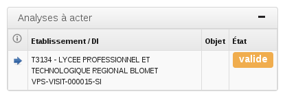

L'objet de ce widget est de permettre au rôle "secrétaire" de visualiser les analyses validées et donc à acter (pour lesquelles il faut générer le Procès Verbal). Si le dossier d'instruction lié à l'analyse est clôturé l'analyse n'apparaît pas. Le widget n'apparaît pas si aucune analyse n'est dans ce cas.

Widget "Analyses à valider"
###########################

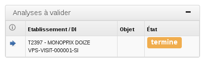

L'objet de ce widget est de permettre au rôle "cadre" de visualiser les  analyses terminées et donc à valider. Si le dossier d'instruction lié à l'analyse est clôturé l'analyse n'apparaît pas. Le widget n'apparaît pas si aucune analyse n'est dans ce cas.

Widget "Autorités de police qui n'ont pas été notifiées ou exécutées"
#####################################################################

L'objet de ce widget est de permettre de visualiser les autorités de police non notifiées ou exécutées. Le widget n'apparaît pas si aucune autorité de police n'est dans ce cas.

Widget "Convocations exploitants à envoyer"
###########################################

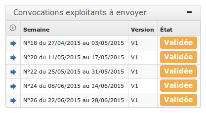

Ce widget liste les programmations pour lesquelles les envois de convocations aux exploitants sont à effectuer. Le widget n'apparaît pas si aucune programmation n'est dans ce cas.

Widget "Convocations membres à envoyer"
#######################################

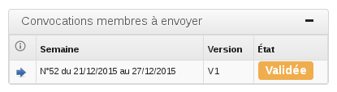

Ce widget liste les programmations arrivant dans moins de 2 semaines et pour lesquelles les envois de convocations aux membres sont à effectuer. Le widget n'apparaît pas si aucune programmation n'est dans ce cas.

Widget "Documents entrants à valider"
#####################################

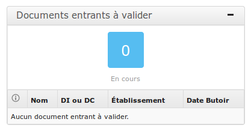

Ce widget permet au cadre de savoir combien il a de documents entrants à vérifier et de visualiser la liste des cinq derniers. Un lien permet d'accéder à la liste complète.

Widget "Documents entrants suivis"
##################################

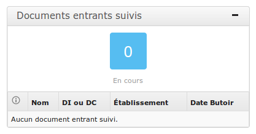

Ce widget permet de lister tous les documents entrants pour lesquels le suivi est activé. Les documents entrants sont triés par date butoir.

Widget "Dossiers de coordination à qualifier"
#############################################

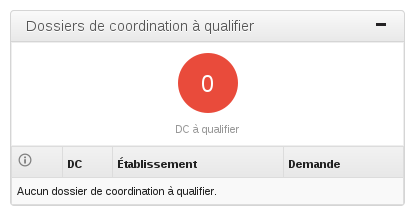

Ce widget affiche les 5 plus anciens dossiers à qualifier, avec un lien permettant d'afficher tous les dossiers à qualifier.

Widget "Dossiers de coordination à clôturer"
############################################

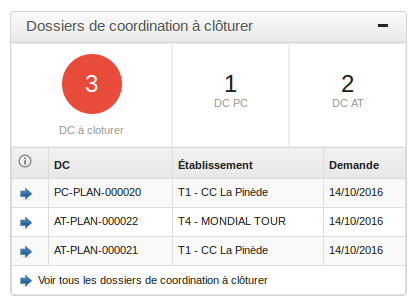

Ce widget affiche les 5 plus anciens dossiers dont les dossiers d'instruction sont clôturés, avec un lien permettant d'afficher tous les dossiers à clôturer.

Widget "Établissements NPAI"
############################

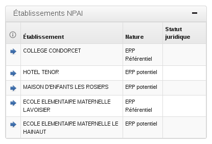

L'objet de ce widget est de permettre de lister les établissements dont l'adresse de contact est incorrecte afin d'effectuer des recherches hors logiciel. Le widget n'apparaît pas si aucun établissement n'est dans ce cas.

Widget "Mes documents entrants non lus"
#######################################

.. image:: widget_mes_documents_entrants_non_lus.png

Ce widget liste les documents entrants associés à un dossier dont l'utilisateur est identifié comme instructeur et qui est noté comme « non lu » avec un lien vers le dossier en question ainsi qu'un lien qui permet d'accéder au listing de tous les documents entrants non lus de l'utilisateur.

Widget "Mes dossiers en réunion"
################################

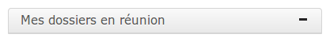

Ce widget liste tous les dossiers dont l'utilisateur connecté est l'instructeur et qui passent en réunion dans les 30 jours suivant la date du jour avec un lien vers le dossier en question. Le listing contient une rupture par réunion (la date et le libellé du type de réunion sont affichés), puis par catégorie de passage de la réunion en question (le libellé de la catégorie est affiché).

Widget "Mes dossiers plans"
###########################

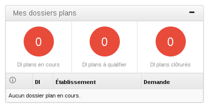

Ce widget liste les 5 plus récents dossiers plans dont l'utilisateur connecté est identifié comme instructeur avec un lien vers le dossier en question ainsi qu'un lien qui permet d'accéder au listing de tous les dossiers plans de l'utilisateur.

Widget "Mes dossiers visites"
#############################

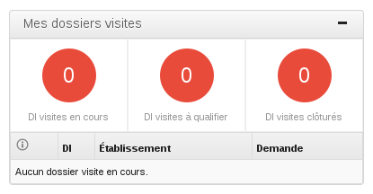

Ce widget liste les 5 plus anciens dossiers visites dont l'utilisateur connecté est identifié comme instructeur avec un lien vers le dossier en question ainsi qu'un lien qui permet d'accéder au listing de tous les dossiers visites de l'utilisateur.

Widget "Mes infos"
##################

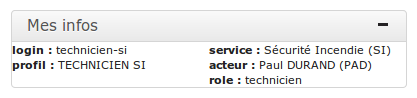

Ce widget a été créé spécifiquement pour des besoins de test de l'application. Il permet d'afficher les informations de l'utilisateur actuellement connecté. En effet, pour faciliter les tests avec différents utilisateurs, différents profils et différents services, il est plus facile d'avoir un widget qui rassemble ces informations sur le tableau de bord.

Widget "Mes messages"
#####################

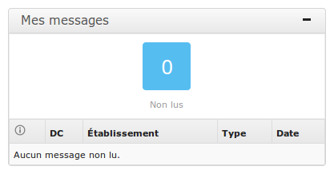

Ce widget indique le nombre de messages non lus pour l'utilisateur connecté. 

Si l'utilisateur est CADRE sont considérés comme non lus :

- tous les messages dont le marqueur CADRE de son service est à non lu, 
- tous les messages dont le marqueur TECHNICIEN de son service est à non lu sur les messages rattachés à un dossier sur lequel il est référencé comme technicien.

Si l'utilisateur est TECHNICIEN sont considérés comme non lus :

- tous les messages dont le marqueur TECHNICIEN de son service est à non lu sur les messages rattachés à un dossier sur lequel il est référencé comme technicien.

Une liste présente les cinq derniers messages arrivés. Un lien permet d'accéder à une liste complète des messages non lus de l'utilisateur. Un clic sur le message permet d'accéder à la fiche de visualisation du message dans le contexte du dossier d'instruction si l'utilisateur est TECHNICIEN et dans le contexte du dossier de coordination sur l'utilisateur est CADRE.

Widget "Mes visites à réaliser"
###############################

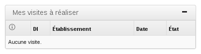

Ce widget liste les 5 prochaines visites à réaliser par l'utilisateur avec un lien vers le dossier en question ainsi qu'un lien qui permet d'accéder au listing de toutes les prochaines visites de l'utilisateur. L'état de la visite permet au technicien de savoir qu'une visite qui lui avait été programmée a été annulée.

Widget "Mon activité"
#####################

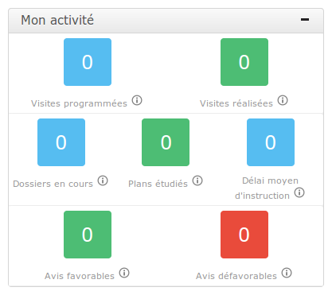

Ce widget représente les chiffres statistiques définis dans la section Pilotage concernant l'utilisateur connecté.

Widget "Profil non configuré"
#############################

.. image :: widget_profil_non_configure.png

Ce widget permet d'informer l'utilisateur que son profil n'est pas encore configuré correctement et qu'il doit prévenir son administrateur pour que ce soit le cas.

Widget "Programmations à valider"
#################################

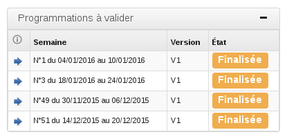

Principalement destiné au cadre, ce widget permet d'afficher toutes les programmations qui ont été finalisées et qui sont donc à valider. Le widget n'apparaît pas si aucune programmation n'est dans ce cas.

Widget "Programmations urgentes"
################################

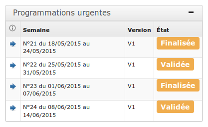

Ce widget liste les programmations arrivant dans moins de 3 semaines pour lesquelles les envois de convocations ne sont pas terminés. Le widget n'apparaît pas si aucune programmation n'est dans ce cas.

