#########################
Rubrique "Établissements"
#########################

.. image:: menu-rubrik-etablissements.png

La rubrique "Établissements" contient les accès aux établissements et unités d'accessibilité.

Les établissements
==================

Les listings des établissements
-------------------------------

Chacun des deux listings permet une recherche avancée complète sur plusieurs critères.

.. image:: etablissement-listing-search.png

Lorsqu'un Système d'Information Géographique est paramétré, chaque ligne des listings d'établissements contient un icône en forme de Terre. Celui-ci permet d'être redirigé sur le SIG avec la vue centrée sur l'établissement correspondant à cette ligne.

Depuis le menu "Référentiel ERP"
################################

Liste tous les établissements qui constituent le référentiel officiel des ERP.

Lorsqu'un Système d'Information Géographique est paramétré, un icône en forme de Terre au-dessus du listing permet d'être redirigé vers le SIG et de consulter la sélection actuelle d'établissements. S'il n'y a pas eu de recherche avancée, le bouton redirige vers la couche des établissements sur le SIG.

.. image:: etablissement_referentiel_erp-listing.png

Depuis le menu "Tous les établissements"
########################################

Liste tous les établissements ERP, les référentiels et les autres.

Lorsqu'un Système d'Information Géographique est paramétré, un icône en forme de Terre au-dessus du listing permet d'être redirigé vers le SIG et de consulter la sélection actuelle d'établissements. S'il n'y a pas eu de recherche avancée, le bouton redirige vers la couche des établissements sur le SIG.

.. image:: etablissement_tous-listing.png

Ajouter un établissement
------------------------

Il est possible d'ajouter un établissement depuis les deux listings, soit depuis le formulaire d'ajout ou de modification d'un dossier de coordination. Dans chaque cas le formulaire est identique.

.. image:: etablissement-form-ajouter.png

Lorsqu'un Système d'Information Géographique est paramétré, openARIA va tenter de géolocaliser automatiquement l'établissement lors de sa création. Cette géolocalisation se fait sur la base de l'adresse, des parcelles et du numéro de dossier ADS qui ont été renseignés. 

Si l'établissement a été géolocalisé automatiquement sur le SIG grâce aux informations renseignées, le message suivant apparaît, en indiquant la précision de la géolocalisation.

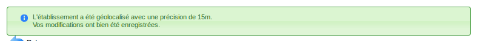

Si l'établissement n'a pas pû être géolocalisé automatiquement, un message est affiché, qui contient un lien permettant à l'utilisateur de dessiner manuellement l'établissement sur le SIG.

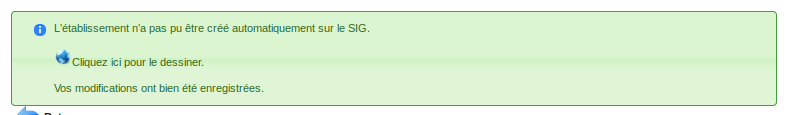

Une fois ce dessin manuel effectué sur le SIG, il faut faut lancer l'action de géolocalisation depuis la fiche de l'établissement créé pour valider le dessin manuel. En cas de succès, un message de validation apparaît, en indiquant la précision de la géolocalisation.

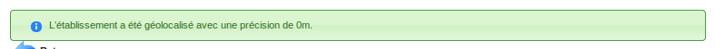

Si l'établissement existe déjà sur le SIG, un message indique à l'utilisateur que celui-ci a déjà été géolocalisé.

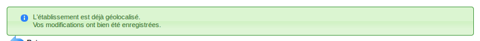

Les établissements peuvent également être ajoutés depuis un fichier CSV. Un fichier CSV modèle est disponible sur le formulaire d'importation.

Même lorsqu’un Système d’Information Géographique est paramétré, depuis cette méthode, les établissements ne sont pas géolocalisés automatiquement. Les établissements restent géolocalisable depuis l'interface de géolocalisation de tous les établissements et des dossiers de coordination (voir :ref:`administration_geolocalisation` Géocoder tous). 

.. image:: etablissement-form-import.png

La fiche d'un établissement
---------------------------

.. image:: etablissement-fiche.png

Lorsqu'un Système d'Information Géographique est paramétré, les icônes en forme de Terre présents dans la fiche permettent d'être redirigé sur le SIG avec la vue centrée sur l'élément choisi :

- si l'établissement a été géolocalisé, l'icône dans le champ "Géolocalisé" permet de visualiser l'établissement sur le SIG
- si des références cadastrales ont été renseignées, l'icône dans le champ références cadastrales permet de visualiser ces parcelles sur le SIG.

Les ERP référentiels
####################

Les ERP référentiel officiel font l'objet de visites périodiques obligatoire suivant leur type et catégorie (les ERP de type Plein Air n'ont pas de visite périodique).

La mise à jour des données des ERP référentiels se fait uniquement par une décision de procès-verbal.

Les ERP autres que référentiels
###############################

Les données des ERP autres que référentiel peuvent être mises à jour sans que cela se passe par une décision.

Ouverture / Fermeture d'un ERP
##############################

L'ouverture et la fermeture d'un ERP référentiel se fait depuis un arrêté. Pour les autres ERP il est possible de passer par le formulaire.

En cas d'extrême urgence, l'administrateur peut également modifier le statut d'ouverture d'un ERP référentiel.

Gestion de l'exploitant et des mandataires
------------------------------------------

L'exploitant est le responsable unique de l'établissement, de ce fait il peut être ajouté seulement depuis la fiche de l'établissement. La fiche de l'exploitant est visible depuis l'onglet "Contacts" de l'établissement, il est possible de le modifier de cet endroit. Une synchronisation se fera entre les données des deux enregistrements.

.. image:: etablissement_exploitant-form-ajouter.png

Il possible d'ajouter d'autres contacts, de type autre qu'exploitant. Ceux-ci seront visible au moyen de l'onglet des contacts de l'établissement.

.. image:: etablissement_contact-listing.png

.. _etablissement_geolocaliser:

Géolocaliser un établissement
-----------------------------

Si un SIG a été paramétré et que l'établissement n'a pas déjà été géolocalisé, une action dans le portail d'actions contextuelles permet de le géolocaliser sur le SIG.

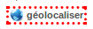

Si l'établissement a été géolocalisé automatiquement sur le SIG grâce aux informations renseignées, le message suivant apparaîtra, en indiquant la précision de la géolocalisation.

Si ces informations ne permettent pas de géolocaliser automatiquement l'établissement, un message sera affiché, qui contiendra un lien permettant à l'utilisateur de dessiner manuellement l'établissement sur le SIG.

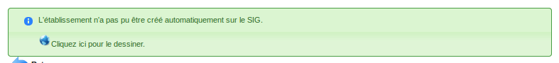

Une fois ce dessin manuel effectué sur le SIG, il faut une nouvelle fois lancer l'action de géolocalisation du portail d'actions contextuelles pour valider le dessin manuel. En cas de succès, un message de validation apparaît.

Si l'établissement existe déjà sur le SIG, un message indique à l'utilisateur que celui-ci a déjà été géolocalisé.

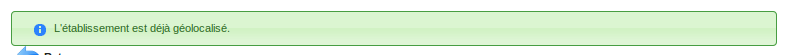

.. _etablissement_recup_proprietaire:

Récupérer les propriétaires de parcelles
----------------------------------------

Si un SIG a été paramétré et que les références cadastrales sont renseignées, une action sur le champ des références cadastrales permet de récupérer la liste des propriétaires par parcelles.

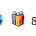

L'action ouvre un overlay nommé "Liste des propriétaires".

Si les parcelles renseignées ont un ou plusieurs propriétaires, une liste est présentée à l'utilisateur.

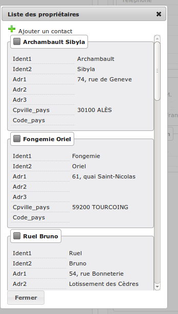

Il se peut que le SIG ne récupère aucun propriétaires.

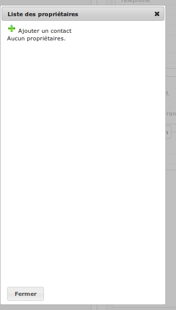

En cas d'erreur de la part du SIG, une erreur est affichée à l'utilisateur.

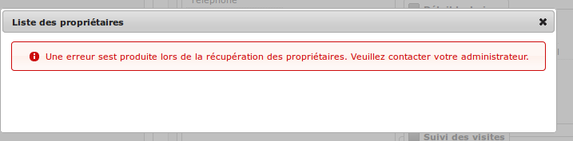

Dans le cas du retour d'aucun ou de plusieurs propriétaires, il est possible d'ajouter un contact sur l'établissement directement depuis cette interface en cliquant sur le bouton d'ajout d'un contact.

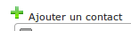

Le formulaire d'ajout d'un contact apparaît à coté de la liste des propriétaires pour faciliter les copier-coller.

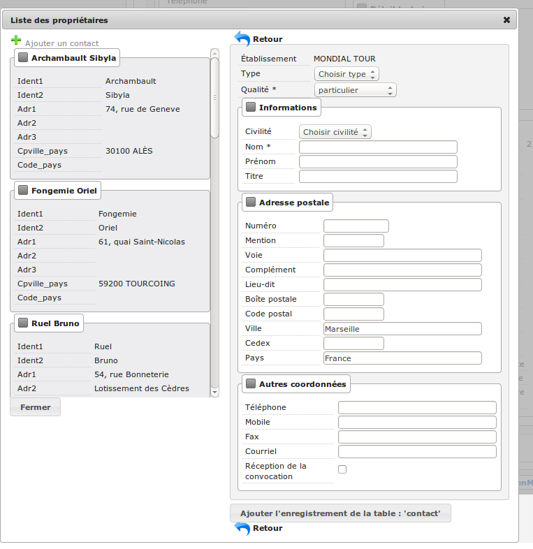

Les boutons de retour permettent de fermer le formulaire d'ajout d'un contact tout en gardant la liste des propriétaires.

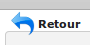

Le bouton de fermeture situé en dessous de la liste des propriétaires permet de fermer la fenêtre entière même si le formulaire d'ajout d'un contact est toujours ouvert.

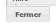

Archiver un établissement
-------------------------

Les établissements peuvent être archivés. Ils n'apparaitront plus dans le listing par défaut.

.. image:: etablissement-action-archiver-link.png

Un établissement archivé à la possiblité d'être désarchivé.

.. image:: etablissement-action-desarchiver-link.png

Lien avec le référentiel des voies
----------------------------------

Les voies sont récupérées automatiquement depuis le référentiel officiel grâce à  un processus quotidien qui récupérera le fichier de voies actualisées du référentiel et mettra à jour la table des voies dans OpenARIA.
Un champ de complétion automatique, avec un affichage des voies au fur et à mesure de la frappe, est utilisé pour la sélection de la voie. Les arrondissements seront alors filtrés par rapport à ces voies.

.. image:: etablissement-form-autocomplete.png

Les voies sont utilisées lors de la saisie des adresses, afin d'éviter toute erreur de saisie. Le changement de libellé de voie sera répercuté automatiquement sur les établissements. Les voies qui viennent du référentiel et n'existent plus seront désactivées et ne seront plus disponibles pour les nouvelles saisies.

.. _etablissement_interface_avec_le_referentiel_patrimoine:

Lien avec le référentiel patrimoine
-----------------------------------

La référence patrimoine ne sera affichée que si le statut juridique de l'établissement est "ville" et que :ref:`l'option est activée<module_interface_avec_le_referentiel_patrimoine>`.
Les références patrimoines sont obtenu à partir des références de parcelles.

Le fonctionnement est le suivant :

- suite à la saisie des références cadastrales, l'utilisateur disposera d'une action permettant de rechercher la référence patrimoine,
- cette action déclenchera un web service vers le référentiel patrimoine,
- le web service répondra avec une liste d’éléments de patrimoine,
- l'utilisateur sélectionnera les éléments qui sont pertinent,
- les références patrimoines seront stockées au sein de la fiche de l'établissement.

.. image:: etablissement-form-patrimoine.png

.. _etablissement_onglet_contraintes:

Onglet Contraintes
------------------

Liste
#####

Les contraintes affichées dans le tableau sont classées par groupe et sous-groupe, et éventuellement par le numéro d’ordre d’affichage si elles en possèdent un.
Chacune dispose de boutons permettant de la consulter, modifier et supprimer.
En sus du tableau deux liens permettent d'ajouter et récupérer des contraintes.

.. image:: etablissement-tab-contrainte.png

Formulaire
##########

Seul le texte complété est affiché et modifiable. Si la contrainte a été récupérée depuis le référentiel alors une action permet de la démarquer.

.. image:: etablissement-consulter-contrainte.png

Ajout
#####

On peut ajouter des contraintes du paramétrage d'openARIA. Seules les actives sont proposées (c'est à dire les archivées sont masquées).
Ajouter une contrainte synchronisée avec le référentiel SIG aura le même comportement qu'ajouter une contrainte créée manuellement :
elle ne sera pas marquée comme récupérée.

.. image:: etablissement-ajouter-contrainte.png

Récupération
############

L'option SIG doit être activée pour bénéficier de cette fonctionnalité. Selon les références cadastrales de l'établissement,
openARIA interroge le référentiel SIG pour récupérer les contraintes applicables à ces parcelles.
Si le logiciel ne dispose pas des dites contraintes, il proposera de les synchroniser.
Sinon, il ajoutera automatiquement ces contraintes à l'établissement (ou les mettra à jour si elles étaient déjà appliquées).
Le texte complété d'une contrainte récupérée est celui du référentiel SIG éventuellement concaténé au texte surchargé si ce dernier est défini dans le paramétrage.
Ce texte sera toujours écrasé lors d'une récupération : vous devez démarquer la contrainte si vous ne souhaitez pas que cela soit le cas.

.. image:: etablissement-recuperer-contrainte.png

Éditions
########

Lors de la rédaction des lettres-types vous pouvez afficher les contraintes de l'établissement en appelant la variable de substitution *&contraintes_etab*.
Cette dernière est remplacée par une liste à puces de toutes les contraintes, classées par groupe et sous-groupe.

* Pour un affichage à plat, sans puce ni groupe ni sous-groupe, appelez *&contraintes_etab(affichage_sans_arborescence=t)*.
* Pour filtrer par groupe(s) appelez *&contraintes_etab(liste_groupe=g1)*. Si plusieurs séparez par une virgule sans espace.
* Pour filtrer par sous-groupe(s) appelez *&contraintes_etab(liste_ssgroupe=sg1,sg2)*. Si plusieurs séparez par une virgule sans espace.

.. note::

  * Les trois paramètres sont optionnels et cumulables : séparez les par un point-virgule sans espace. Ex. : *&contraintes_etab(liste_groupe=g1;affichage_sans_arborescence=t)*.
  * La même fonctionnalité est disponible pour les dossiers de coordination : la variable est *&contraintes_dc*.
  * S'il n'y a pas de contrainte et ce quelle que soit la raison (aucun établissement rattaché au dossier de coordination, aucune contrainte appliquée) la variable de substitution est tout de même supprimée lors de l'édition.

Onglet UA
---------

Cet onglet présente un écran permettant d'accéder à trois listings :

• un listing des UA validées
• un listing des UA en projet
• un listing des UA archivées

Au clic sur l'onglet UA, on accède par défaut au listing des UA validées.

.. image:: etablissement_onglet-ua.png

Listing des UA validées
#######################

Une action d'ajout d'une UA est disponible depuis ce listing. Un lien représenté par un plus vert permet d'accéder au formulaire d'ajout d'une UA.

Un clic sur chaque ligne du listing permet d'accéder à la fiche de visualisation d'une UA.

Le tableau comporte les colonnes suivantes :

- « libellé » : c'est le libellé de l'UA qui permet de l'identifier parmi les autres UA de l'établissement.
- « acc. auditif » : information sur l'accessibilité au handicap auditif de l'UA. Les valeurs possibles sont : « Oui » / « Non » / « » (vide).
- « acc. mental » : information sur l'accessibilité au handicap mental de l'UA. Les valeurs possibles sont : « Oui » / « Non » / « » (vide).
- « acc. physique » : information sur l'accessibilité au handicap physique de l'UA. Les valeurs possibles sont : « Oui » / « Non » / « » (vide).
- « acc. visuel » : information sur l'accessibilité au handicap visuel de l'UA. Les valeurs possibles sont : « Oui » / « Non » / « » (vide).
- « dérogation » : information indiquant si l'UA possède une dérogation ou non. Les deux valeurs possibles sont : « Oui » et « » (vide).

.. image:: etablissement-onglet-ua-listing-ua-validees.png

Listing des UA en projet
########################

Aucune action d'ajout d'une UA n'est possible depuis ce listing.

Un clic sur chaque ligne du listing permet d'accéder à la fiche de visualisation d'une UA.

Le tableau comporte les colonnes suivantes :

- « libellé » : c'est le libellé de l'UA qui permet de l'identifier parmi les autres UA de l'établissement.
- « acc. auditif » : information sur l'accessibilité au handicap auditif de l'UA. Les valeurs possibles sont : « Oui » / « Non » / « » (vide).
- « acc. mental » : information sur l'accessibilité au handicap mental de l'UA. Les valeurs possibles sont : « Oui » / « Non » / « » (vide).
- « acc. physique » : information sur l'accessibilité au handicap physique de l'UA. Les valeurs possibles sont : « Oui » / « Non » / « » (vide).
- « acc. visuel » : information sur l'accessibilité au handicap visuel de l'UA. Les valeurs possibles sont : « Oui » / « Non » / « » (vide).
- « dérogation » : information indiquant si l'UA possède une dérogation ou non. Les deux valeurs possibles sont : « Oui » et « » (vide).

.. image:: etablissement-onglet-ua-listing-ua-en-projet.png

Listing des UA archivés
#######################

Aucune action d'ajout d'une UA n'est possible depuis ce listing.

Un clic sur chaque ligne du listing permet d'accéder à la fiche de visualisation d'une UA.

Le tableau comporte les colonnes suivantes :

- « libellé » : c'est le libellé de l'UA qui permet de l'identifier parmi les autres UA de l'établissement.
- « acc. auditif » : information sur l'accessibilité au handicap auditif de l'UA. Les valeurs possibles sont : « Oui » / « Non » / « » (vide).
- « acc. mental » : information sur l'accessibilité au handicap mental de l'UA. Les valeurs possibles sont : « Oui » / « Non » / « » (vide).
- « acc. physique » : information sur l'accessibilité au handicap physique de l'UA. Les valeurs possibles sont : « Oui » / « Non » / « » (vide).
- « acc. visuel » : information sur l'accessibilité au handicap visuel de l'UA. Les valeurs possibles sont : « Oui » / « Non » / « » (vide).
- « dérogation » : information indiquant si l'UA possède une dérogation ou non. Les deux valeurs possibles sont : « Oui » et « » (vide).
- « état » : c'est l'état de l'UA. Les deux valeurs possibles sont : « en projet » et « validé ».

.. image:: etablissement-onglet-ua-listing-ua-archives.png

.. _etablissements_etablissement_onglet_documents_entrants:

Onglet Documents Entrants
-------------------------

L'onglet "Document Entrants" sur la fiche d'un établissement affiche tous ses documents entrants liés (ainsi que ceux éventuellement liés aux dossiers d'instruction et aux dossiers d'instruction rattachés à l'établissement). Les informations présentées sont :

- le nom du document,
- le type du document (acte, courrier de l'explotant, ...),
- la date de création du document,
- la date de réception du document,
- la date d'émission du document,
- la date butoir du document,
- le statut du document (en cours, qualifié, ...).

.. image:: etablissement-onglet-documents-entrants-listing.png

Les unités d'accessibilité (UA)
===============================

Les unités d'accessibilité (UA) permettent de découper les établissements en plus petites unités au sens de l'accessibilité. Ces unités ont vocation à stocker les données techniques particulières à cette unité au sein de l'établissement.

Le listing des UA
-----------------

.. image:: etablissement-ua-listing.png

Ce listing est un tableau qui fait apparaître toutes les UA qui ne sont pas archivées. Une recherche avancée permet de filtrer les UA qui apparaissent dans le listing. 

Aucune action d'ajout d'une UA n'est possible depuis ce listing.

Un clic sur chaque ligne du listing permet d'accéder à la fiche de visualisation d'une UA.

Le tableau comporte les colonnes suivantes :

- « libellé » : c'est le libellé de l'UA qui permet de l'identifier parmi les autres UA de l'établissement
- « établissement » : même chose que pour le reste des listings
- « adresse » : même chose que pour le reste des listings
- « accessible » : les quatre informations sur l'accessibilité de l'UA sont concaténées dans la même cellule du tableau (auditif : « Oui » / « Non » / « » (vide), mental : « Oui » / « Non » / « » (vide), physique : « Oui » / « Non » / « » (vide), visuel : « Oui » / « Non » / « » (vide))
- « état » : c'est l'état de l'UA. Les deux valeurs possibles sont : « en projet » et « validé »

Lorsqu'un Système d'Information Géographique est paramétré, les icônes en forme de Terre de chaque ligne du tableau permettent d'être redirigé sur le SIG avec la vue centrée sur l'établissement lié à cette UA.

La recherche avancée des UA
---------------------------

.. image:: etablissement-ua-search.png

La recherche avancée permet de filtrer les UA qui apparaissent dans le listing sur les critères suivants :

- « Libellé » : texte libre sur le libellé de l'UA.
- « Établissement » : texte libre sur le code et le libellé de l'établissement. Identique au critère de recherche du même nom dans les recherches avancées des écrans de listing de dossiers.
- « Numéro » : texte libre. Identique au critère de recherche du même nom dans les recherches avancées des écrans de listing de dossiers.
- « Voie » : texte libre. Identique au critère de recherche du même nom dans les recherches avancées des écrans de listing de dossiers.
- « Arrondissement » : liste à choix sur l'arrondissement de l'établissement (valeurs : « 1er », « 2ème », ... Ce sont les valeurs disponibles dans le paramétrage des arrondissements ). Identique au critère de recherche du même nom dans les recherches avancées des écrans de listing de dossiers. Si aucune sélection « Choisir », ce critère n'applique aucun filtre sur le listing.
- « État » : liste à choix sur l'état de l'UA (valeurs : « en projet », « validé »). Si aucune sélection « Choisir », ce critère n'applique aucun filtre sur le listing.
- « Accessible auditif » : liste à choix sur l'information sur l'accessibilité au handicap auditif de l'UA (valeurs : « Oui », « Non »). Si aucune sélection « Choisir », ce critère n'applique aucun filtre sur le listing.
- « Accessible mental » : liste à choix sur l'information sur l'accessibilité au handicap mental de l'UA (valeurs : « Oui », « Non »). Si aucune sélection « Choisir », ce critère n'applique aucun filtre sur le listing.
- « Accessible physique » : liste à choix sur l'information sur l'accessibilité au handicap physique de l'UA (valeurs : « Oui », « Non »). Si aucune sélection « Choisir », ce critère n'applique aucun filtre sur le listing.
- « Accessible visuel » : liste à choix sur l'information sur l'accessibilité au handicap visuel de l'UA (valeurs : « Oui », « Non »). Si aucune sélection « Choisir », ce critère n'applique aucun filtre sur le listing.

La recherche avancée affiche les champs de recherche les uns à la suite des autres sans possibilité de regroupement.

La fiche d'une UA
-----------------

Lorsqu'un Système d'Information Géographique est paramétré et que l'établissement lié à cette UA a été géolocalisé, l'icône en forme de Terre permet d'être redirigé sur le SIG avec la vue centrée sur l'établissement lié.

.. image:: etablissement-ua-view.png

