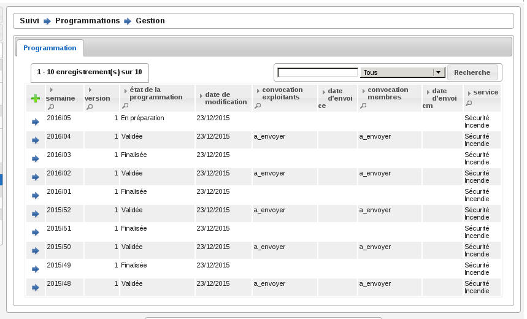
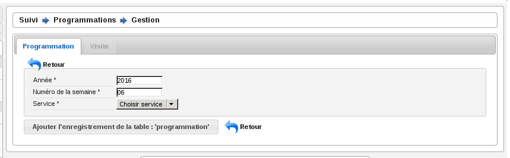
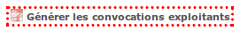
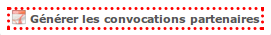
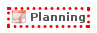
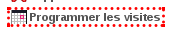
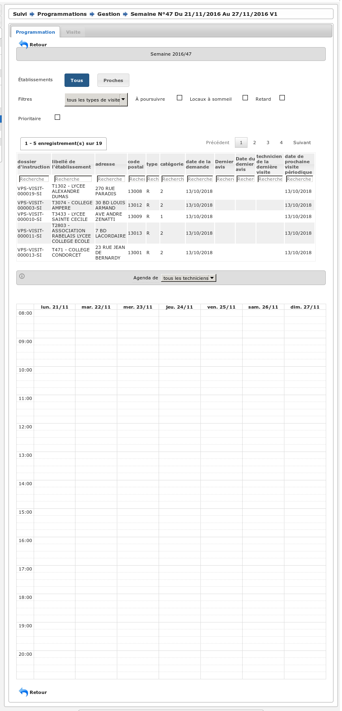

################
Rubrique "Suivi"
################

.. image:: menu-rubrik-suivi.png

La rubrique "Suivi" est divisée en catégories :

- Documents entrants

- Documents générés

- Programmations

- Réunions

- Pilotage

Programmations
==============

(:menuselection:`Suivi --> Programmations --> Gestion`)

La programmation des visites est gérée par semaine, elle est identifiée par l'année et le numéro de semaine (Ex : 2015/39). Les numéros de semaines sont calculées selon la norme ISO (chaque semaine fait 7 jours et peut être à cheval sur deux années selon l'année il peut y en avoir 52 ou 53).

Le listing des programmations
-----------------------------

Ce listing présente les programmations spécifiques au service de l'utilisateur connecté. 

Ajouter une programmation
-------------------------

Le listing des programmations présente un bouton "Ajouter" qui permet d'accéder au formulaire d'ajout d'une nouvelle semaine de programmation.

Par défaut, le formulaire d'ajout d'une semaine de programmation est pré-rempli avec le numéro de semaine supérieur à celui de la dernière semaine de programmation existante. Par exemple si la dernière semaine créée est 2015/23 alors la prochaine sera 2015/24.

La fiche de la programmation
----------------------------

.. image:: programmations-fiche.png

Onglet "Visites"
################

Cet onglet présente la liste de toutes les visites liées à la programmation en cours. Les informations présentées sont :

- la date et l'heure de la visite,
- l'état de la visite,
- le technicien,
- l'état d'envoi des convocations aux exploitants,
- la date d'annulation s'il y en a une,
- les versions de programmation pendant la vie de la visite. 

En cliquant sur la ligne on accédera à la visite avec son détail et tous les envois liés. On aura aussi accès aux fonctions d'envoi de convocation ou courrier d'annulation.

La vie de la programmation
--------------------------

Le numéro de version à la création de la programmation est 1. Il est incrémenté chaque fois qu'une nouvelle version de la programmation est créée.

L'état de la programmation est "En préparation" par défaut. Les états sont successivement :

- "En préparation" : c'est uniquement quand la programmation est dans cet été que l'on peut ajouter,  modifier et annuler les visites. Depuis cet état l'action finaliser la programmation est disponible et permet de passer dans l'état "Finalisée".
- "Finalisée" : il est possible de la réouvrir, ce qui la repasse à l'état "En préparation" ou de la valider ce qui la passe à l'état "Validée".
- "Validée" : il est possible de générer les convocations et/ou de créer une nouvelle version de la programmation, ce qui la répasse à l'état "En préparation" en incrémentant le numéro de version. 

Les convocations
################

Liste des statuts des convocations :

- Vide : la programmation est "En préparation" ou "Finalisée" sur une version 1 ou sur une version > 1 dont le statut de la convocation était vide ou "À envoyer".
- "À envoyer" : la programmation est "Validée" sur une version 1.
- "À compléter" ou "À renvoyer" : si sur une version > à 1 et le statut de la convocation était "Envoyée".
- "Envoyée" : si les convocations sont envoyées.

La convocation des exploitants
,,,,,,,,,,,,,,,,,,,,,,,,,,,,,,

Les convocatiosn sont des documents générés et apparaissent dans l'onglet "Documents Générés" dans le contexte du dossier d'instruction.

Les convocations des exploitants sont dans l'ordre :

- Non effectuées pour la version courante (tant que la version n'est pas validée on laisse le champ vide)
- A envoyer (la programmation a été validée et aucune convocation n'a été envoyée)
- Envoyées (toutes les convocations ont été envoyées)
- A compléter (si les convocations étaient Envoyées dans une version précédente, il faut compléter les envois)

L'action "Générer les convocations exploitant" génère pour chaque visite dont le statut d'envoi de convocation est "à envoyer" un document généré à chaque contact de l'établissement marqué comme destinataire des courriers (que ce soit pour les courriers de convocation ou pour les courriers d'annulation).

La convocation des membres
,,,,,,,,,,,,,,,,,,,,,,,,,,

Les convocations des membres sont dans l'ordre :

- Non envoyées pour la version courante (tant que la version n'est pas validée on laisse le champ vide)
- "A envoyer" (la programmation a été validée. Si c'est une nouvelle version de la programmation, celle-ci est tout de même A envoyer.)
- "Envoyée" (la programmation a été envoyée)

Une action permet d'envoyer par mail la convocation des membres au format PDF à tous les contacts institutionnels du service de la programmation dont la case "réception de la programmation" est cochée ainsi qu'à tous les techniciens présents dans les visites de la programmation.

Le document comporte les informations suivantes :

- planning de la programmation de la semaine
- historique, comportant pour chaque version de la programmation :

* numéro de version de la programmation
* liste des visites ajoutées
* liste des visites annulées
* date de la finalisation de la version de la programmation

Une action permet de télécharger la convocation une fois que la programmation est validée.

Exemple
#######

Voici donc un scénario pour une semaine "2014/07" :

- Version 1: préparation, finalisation, réouverture pour correction, finalisation, validation, envoi des convocations exploitant seulement.
- Version 2: suite aux retours des exploitants, préparation v2, finalisation, validation, envoi des convocations exploitant seulement.
- Version 3: suite aux retours des exploitants, préparation v3, finalisation, validation, envoi des convocations exploitant et membres.
- Version 4: suite aux retours des exploitants, préparation v4, finalisation, validation, envoi des convocations exploitant et membres.

La planification des visites
----------------------------

L'écran de planification des visites est composé de deux blocs principaux : la liste des dossiers d'instruction de type VISIT qui sont en attente de programmation et l'agenda des visites de la semaine.

Bloc de propositions
####################

Les propositions sont classées par défaut selon l'ordre suivant :

- 1 - A poursuive, par code de technicien, croissant,
- 2 - Visites périodiques avec locaux à sommeil,
- 3 - Visites de contrôle avec locaux à sommeil,
- 4 - Visites de réception,
- 5 - Visites périodiques sans locaux à sommeil,
- 6 - Visites de contrôle sans locaux à sommeil,
- les visites sont classées par date de visite croissante.

En plus du tri par défaut, il est possible de filtrer les dossiers selon :

- leur type de visite : une liste à choix propose soit tous les types, soit les périodiques, soit les contrôles, soit les réceptions,
- si la visite est à poursuivre (la visite doit avoir lieu en plusieurs fois),
- si la visite porte sur un établissement avec locaux à sommeil,
- si la visite est en retard (c'est-à-dire si la date butoir du dossier de coordination est dans le passé),
- si la visite porte sur un dossier d'instruction prioritaire.

De plus chaque colonne peut être filtrée grâce à un champ de recherche ainsi que triée grâce à un clic sur l'entête de colonne.

Bloc agenda
###########

Le calendrier comporte les 7 jours de la semaine, du lundi au dimanche.

Par défaut, l'agenda présenté est celui de tous les techniciens confondus ("Tous"), il n'est alors pas possible de planifier les visites, les dates de congés ne sont pas affichés et les périodes préférentielles des agents non plus. 

Le calendrier affiche alors toutes les visites planifiées. L'affichage comporte le N° d'établissement et l'acronyme du technicien. 

Un clic sur l'affichage permet d'afficher un bloc comportant les informations clés de la visite :
- données du tableau de présentation,
- ainsi qu'un hyperlien permettant d'ouvrir l'établissement et/ou le dossier de visite,
- N° établissement,
- acronyme du technicien,
- type, cat, sommeil,
- type de visite,
- commission compétente.

Lorsqu'un technicien est sélectionné, seules ses visites sont affichées. Les fonds du calendrier sont coloriés en rouge pour les périodes de congés du technicien (par jours et heures) et en vert pour les périodes privilégiées (par demi-journée). Il est alors possible de lui affecter des visites en effectuant un tirer-lacher de la liste de propositions vers le calendrier de planification.

Planifier une nouvelle visite
#############################

Il faut préalablement sélectionner un technicien. Son agenda est alors affiché. Il est dès lors possible de tirer une proposition de visite du cadre supérieur vers une zone de l'agenda du technicien. Cette action provoque l'ouverture d'un formulaire d'ajout d'une visite : celui-ci contient des informations d'aide à la planification et des champs à renseigner.

Informations d'aide à la programmation :

- Code établissement,
- libellé établissement,
- date de prochaine visite périodique prévue,
- type, catégorie, locaux à sommeil,
- type de la visite,
- objet de la visite (par défaut = type de visite),
- durée prévue de visite,
- liste des autres visites liées à ce dossier de visite (cette liste est disponible depuis l'onglet "Visites" du dossier d'instruction concerné dont le lien est présent au-dessus).

Liste des champs à renseigner :

- date de la visite,
- heure de début de visite,
- heure de fin de visite,
- « à poursuivre »,
- observations (texte libre).

Il est à noter que le technicien peut aussi passer le dossier de visite en planification « à poursuivre » lors de la rédaction de son PV de visite.

La vie de la visite
###################

- Visualiser la visite programmée : ceci ouvre la fiche de visite programmée dans une fenêtre superposée à la vue courante. Cette fenêtre contient les informations présentées et saisies lors de la planification de la visite, ainsi que le statut de la visite. Elle comporte notamment un lien direct vers la fiche de l'établissement et un autre lien vers le dossier de visite.

- Modifier la visite : la modification de la date et/ou de l'heure et/ou du technicien de la visite peut se faire jusqu'à ce que la convocation exploitant soit envoyée. Après ce moment il faudra annuler la visite puis la reprogrammer.

- Annuler la visite programmée : il faut alors saisir la date d'annulation (par défaut la date du jour) ainsi que le motif d'annulation. Le motif est choisi au sein de la liste suivante :

 * Annulation exceptionnelle
 * SPGR
 * Indisponibilité d'un membre
 * SCDS
 * Exploitant indisponible
 * Exploitant défaillant
 * NPAI

Lorsqu'une visite est annulée pour tout motif autre que NPAI, le dossier de visite repasse
en dossier à programmer si c'était la seule date de visite, en dossier à poursuivre s'il y a
d'autres visites programmées.

Lorsqu'une visite est annulée pour motif NPAI le dossier de visite est annulé et l'établissement est affiché dans le widget "Établissement NPAI". Il est alors nécessaire de le traiter hors logiciel afin de mettre à jour les informations de l'établissement et prendre les mesures nécessaires.

Un document généré d'annulation est géré selon le même modèle que le document généré de convocation et le statut de convocation est donc noter comme "à compléter" jusqu'à la génération des convocations exploitants par lot à la validation de la version de la programmation.

Suppression d'une programmation
-------------------------------

Il est possible de supprimer une semaine de programmation uniquement si aucune visite n'y a jamais été planifiée.

Réunions
========

(:menuselection:`Suivi --> Réunions --> Gestion`)

Le listing des réunions
-----------------------

Ce listing présente les réunions spécifiques au service de l'utilisateur connecté. 

.. image:: reunions-listing.png

Ajouter une réunion
-------------------

Le listing des réunions présente un bouton "Ajouter" qui permet d'accéder au formulaire d'ajout d'une nouvelle réunion.

.. image:: reunions-form-ajouter.png

Le code de la réunion est composé automatiquement du code du type de réunion sélectionné concaténé avec la date de la réunion (Exemple : CCS-2014-06-22). Le libellé de la réunion est composé du libellé du type de réunion sélectionné concaténé avec la date de la réunion (Exemple : Réunion Plénière CCS du 24/06/2014). Lors de la création de la réunion, les données présentes dans le paramétrage du type de réunion sont récupérées automatiquement dans le formulaire de création (heure, lieu, ...).

La fiche de la réunion
----------------------

.. image:: reunions-fiche.png

Gérer l'ordre du jour de la réunion
-----------------------------------

L'ordre du jour est composé de la liste des dossiers dont les instances présentes vont discuter pendant la réunion. Il y a un unique ordre du jour par réunion. Si le type de réunion contient plusieurs catégories, alors cette liste est groupée par catégorie. Depuis l'écran de gestion de la réunion, plusieurs actions sont disponibles pour la composition de l'ordre du jour.

Réunion
#######

.. image:: reunions-action-meeting-link.png

Cet écran présente un listing de toutes les demandes de passage qui ont été planifiées à la réunion sur laquelle on se trouve, groupées par catégorie.

.. image:: reunions-action-meeting-view.png

Planifier
#########

.. image:: reunions-action-planifier-link.png

Cet écran présente un listing des dossiers pressentis, ce sont toutes les demandes de passage qui n'ont été planifiées à aucune réunion mais dont le type correspond au type de la réunion sur laquelle on se trouve. Des cases à cocher permettent de sélectionner les demandes de passage que l'on souhaite planifier/ajouter à l'ordre du jour. En cliquant sur le bouton de validation, le traitement est effectué sauf si la demande de passage n'est plus disponible. Dans les deux cas un message indique à l'utilisateur le résultat du traitement. Cette action est disponible seulement si la réunion n'a pas déjà été clôturée.

.. image:: reunions-action-planifier-view.png

Pour aider à la saisie des dossiers à planifier, une action permet de sélectionner tous les éléments du listing (cocher toutes les cases à cocher) en un seul clic et un formulaire de recherche permet de filtrer le listing sur :

- une période pour la date souhaitée (du ... au ...),
- la catégorie.

Déplanifier
###########

.. image:: reunions-action-deplanifier-link.png

Cet écran présente un listing des demandes de passage qui ont été planifiées pour la réunion sur laquelle on se trouve. Des cases à cocher permettent de sélectionner les demandes de passage que l'on souhaite retirer de l'ordre du jour. En cliquant sur le bouton de validation, le traitement est effectué sauf si un retour d'avis est déjà saisi dans la demande de passage. Dans les deux cas un message indique à l'utilisateur le résultat du traitement. Pour aider à la saisie des dossiers à déplanifier, une action permet de sélectionner tous les éléments du listing (cocher toutes les cases à cocher) en un seul clic. Cette action est disponible seulement si la réunion n'a pas déjà été clôturée.

.. image:: reunions-action-deplanifier-view.png

Planifier nouveau
#################

.. image:: reunions-action-planifier-nouveau-link.png

Cet écran permet de planifier directement un ou des dossiers d'instruction à la réunion sur laquelle on se trouve sans créer manuellement au préalable une demande de passage sur le ou les dossiers d'instruction concernés. Cette action est disponible seulement si la réunion n'a pas déjà été clôturée.

.. image:: reunions-action-planifier-nouveau-view.png

Trois choix de planification directe sont possibles : 

- programmation : planifie tous les dossiers d'instruction correspondant aux visites présente dans une programmation. Il suffit de sélectionner : la programmation (parmi la liste des programmations passées qui n'ont pas déjà été planifiées pour une autre réunion) et la catégorie (dans laquelle on souhaite insérer ces demandes de passage).

.. image:: reunions-action-planifier-nouveau-view-programmation.png

- réunion : planifie tous les dossiers d'instruction présents dans une réunion. Il suffit de sélectionner : la réunion (parmi la liste des réunions clôturées qui ne sont pas des réunions de commission et qui n'ont pas déjà été planifiées pour une autre réunion) et la catégorie (dans laquelle on souhaite insérer ces demandes de passage).

.. image:: reunions-action-planifier-nouveau-view-reunion.png

- dossier : planifie le dossier d'instruction correspondant au code du dossier de coordination ou du dossier d'instruction saisi. Il suffit de saisir le code du dossier de de sélectionner la catégorie (dans laquelle on souhaite insérer cette demande de passage).

.. image :: reunions-action-planifier-nouveau-view-dossier.png

Numéroter
#########

.. image:: reunions-action-numeroter-link.png

Cette action permet de déclencher la numérotation de l'ordre du jour, c'est-à-dire numéroter la liste des demandes de passage planifiées à partir de 1. Une fois que la numérotation a été déclenchée, tout nouveau dossier prendra le numéro suivant. Un dossier retiré de l'ordre du jour laissera un vide dans la numérotation. La numérotation initiale se fait par catégorie selon l'ordre défini dans le paramétrage du type de réunion. Cette action est disponible que si la numérotation n'a pas déjà été effectuée.

.. image:: reunions-action-numeroter-view.png

Imprimer l'ordre du jour
########################

.. image:: reunions-action-edition-ordre_du_jour-link.png

À tout moment une action permet d'accéder à l'ordre du jour au format PDF en cliquant sur l'action « Ordre du jour » dans l'écran de gestion de la réunion. 

Un modèle de document paramétrable dans le type de réunion sert de base pour l'ordre du jour de la réunion. Il sera composé de champs de fusion et rempli avec les informations de la réunion au moment de sa génération. Un champ de fusion particulier "avis proposé" provient de la demande de passage ou de l'analyse selon le cas.

L'ordre du jour est stocké pour mémoire lors de la clôture de la réunion.

Gérer les membres de la réunion
-------------------------------

Convoquer
#########

.. image:: reunions-action-convoquer-link.png

À tout moment une action permet de convoquer les instances de la réunion en cliquant sur l'action "Convoquer les membres" dans l'écran de gestion de la réunion. Cette action permet d'envoyer un mail aux différentes adresses paramétrées dans les instances, ainsi qu'aux adresses présentes dans le champ « liste de diffusion » de la réunion. Un écran permet de confirmer l'envoi du mail avec une case à cocher permettant d'indiquer si l'ordre du jour doit être envoyé ou non en pièce jointe. La date de dernière convocation est stockée pour mémoire.

.. image:: reunions-action-convoquer-view.png

Feuille de présence
###################

.. image:: reunions-action-edition-feuille_presence-link.png

À tout moment une action permet d'accéder à la feuille de présence au format PDF en cliquant sur l'action « Feuille de présence » dans l'écran de gestion de la réunion. 

Un modèle de document paramétrable dans le type de réunion sert de base pour la feuille de présence de la réunion. Il sera composé de champs de fusion et rempli avec les informations de la réunion au moment de sa génération. 

Sélectionner les signataires
############################

Un écran permet, pour chaque instance de la réunion :

- de sélectionner le membre qui la représente,
- de saisir un texte libre.

L'unique objectif de ces informations est de remplir la feuille de présence.

Gérer les avis
--------------

Rendre l'avis
#############

Depuis l'écran de gestion d'une réunion, le listing des dossiers planifiés (l'ordre du jour) permet d'accéder à chaque formulaire de saisie du retour d'avis. Ce retour est composé des informations suivantes :

- proposition d'avis : lecture seule,
- proposition de complément d'avis (éventuellement second avis) : lecture seule,
- avis : sélection d'un avis dans la liste des avis,
- complément d'avis (éventuellement second avis) : ligne de texte,
- motivation de l'avis : texte.

Il est possible d'imprimer le compte-rendu d'avis depuis cet écran.

Dans cet écran une action permet d'insérer et de saisir des décisions d'autorité de police.

Dans certains cas, il n'y a pas de prise d'avis ou de décision sur un dossier lors d'une réunion. Dans ce cas un avis tel que 'A revoir' ou 'Différé' est saisi, qui permettra la suite du processus. Il est donc nécessaire de reprogrammer un passage pour le dossier en question. Dans le même écran de saisie, une action permet d'insérer et de saisir des demandes de passage en réunion. Le formulaire est identique au formulaire de demande de passage manuel. Il est ainsi possible d'indiquer la date souhaitée de passage, le type de réunion, la catégorie et éventuellement la proposition d'avis.

Imprimer le compte rendu d'avis
###############################

Un modèle de document paramétrable dans le type de réunion servira de base pour le compte-rendu par dossier. Il sera composé de champs de fusion et rempli avec les informations de la réunion au moment de sa génération.

Une action disponible depuis la fiche de visualisation d'une demande de passage permet d'imprimer le "compte-rendu par dossier" de la demande de passage.

.. image:: reunions-action-edition-compte_rendu_specifique-link.png

Une action disponible sur la fiche de la réunion permet d'imprimer l'ensemble des "compte-rendus par dossier" de toutes les demandes de passage en une seule action.

Gérer le compte-rendu et la clôture de la réunion
-------------------------------------------------

Imprimer le compte rendu
########################

.. image:: reunions-action-edition-compte_rendu_global-link.png

Un modèle de document paramétrable dans le type de réunion servira de base pour le compte-rendu global de la réunion. Il sera composé de champs de fusion et rempli avec les informations de la réunion au moment de sa génération.

À tout moment une action permet d'accéder au compte-rendu au format PDF en cliquant sur l'action "Compte-rendu" dans l'écran de gestion de la réunion. Ce compte-rendu global de la réunion est un listing de tous les dossiers avec l'avis résultant de la réunion.

Clôturer
########

.. image:: reunions-action-cloturer-link.png

Une action permet de clôturer la réunion.

Restriction(s) :

- Si toutes les demandes de passage n'ont pas un avis, alors la clôture de la réunion n'est pas possible.
- Une fois la réunion clôturée alors il n'est plus possible de modifier les avis.
- Une fois la réunion clôturée alors il n'est plus possible de modifier l'ordre du jour (les actions/écrans permettant de le gérer disparaissent).

.. image:: reunions-action-cloturer-view.png

Cette action permet d'accéder à un formulaire de confirmation de la clôture de la réunion en donnant le choix à l'utilisateur de diffuser ou non par mail le compte-rendu global. Les actions sont :

- diffuser le compte-rendu par mail aux instances de la réunion (aux différentes adresses paramétrées dans les instances et dans le champ « liste de diffusion »),
- générer et finaliser le compte-rendu (stockage du document),
- générer et finaliser l'ordre du jour (stockage du document),
- noter la réunion comme clôturée.

Charger les fichiers numérisés
##############################

.. image:: reunions-action-integrer-documents-numerises-link.png

Cet écran permet de charger dans la réunion le "compte-rendu global" signé numérisé ainsi que le document rassemblant l'ensemble des "compte-rendus par dossier" signés numérisé. Cette action est disponible seulement une fois que la réunion est clôturée.

.. image:: reunions-action-integrer-documents-numerises-view.png

Supprimer une réunion
---------------------

.. image:: reunions-action-supprimer-link.png

Cet écran permet de supprimer la réunion. Cette action est disponible seulement si aucun dossier planifié à cette réunion n'a d'avis rendu.

Lors de la suppression, toutes les demandes de passages qui lui étaient affectées seront désaffectées et réapparaîtront dans le pool des demandes de passage pour être planifié à une autre réunion. 

