################
Rubrique "Suivi"
################

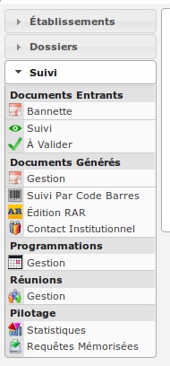

La rubrique "Suivi" est divisée en catégories :

- Documents entrants

- Documents générés

- Programmations

- Réunions

- Pilotage

Réunions
========

(:menuselection:`Suivi --> Réunions --> Gestion`)

Le listing des réunions
-----------------------

Ce listing présente les réunions spécifiques au service de l'utilisateur connecté. 

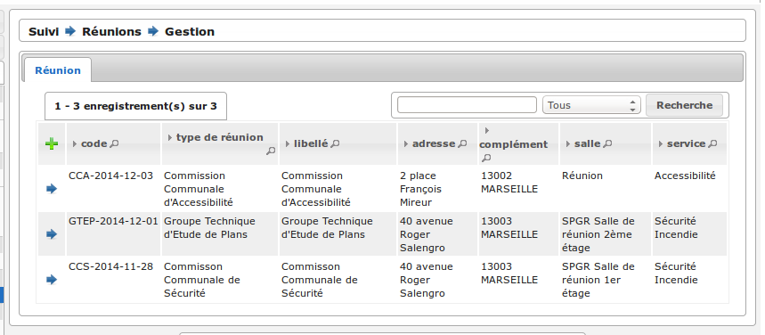

Ajouter une réunion
-------------------

Le listing des réunions présente un bouton "Ajouter" qui permet d'accéder au formulaire d'ajout d'une nouvelle réunion.

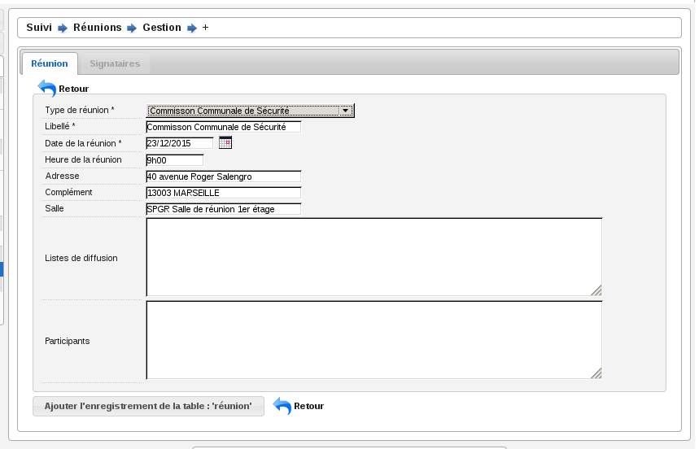

Le code de la réunion est composé automatiquement du code du type de réunion sélectionné concaténé avec la date de la réunion (Exemple : CCS-2014-06-22). Le libellé de la réunion est composé du libellé du type de réunion sélectionné concaténé avec la date de la réunion (Exemple : Réunion Plénière CCS du 24/06/2014). Lors de la création de la réunion, les données présentes dans le paramétrage du type de réunion sont récupérées automatiquement dans le formulaire de création (heure, lieu, ...).

La fiche de la réunion
----------------------

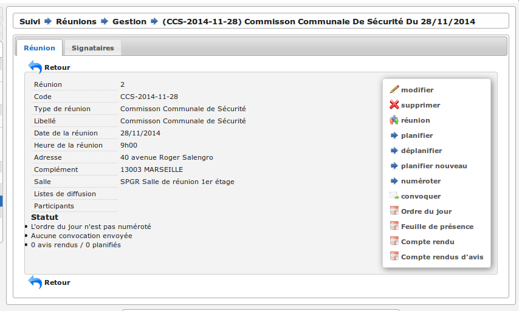

Gérer l'ordre du jour de la réunion
-----------------------------------

L'ordre du jour est composé de la liste des dossiers dont les instances présentes vont discuter pendant la réunion. Il y a un unique ordre du jour par réunion. Si le type de réunion contient plusieurs catégories, alors cette liste est groupée par catégorie. Depuis l'écran de gestion de la réunion, plusieurs actions sont disponibles pour la composition de l'ordre du jour.

Réunion
#######

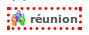

Cet écran présente un listing de toutes les demandes de passage qui ont été planifiées à la réunion sur laquelle on se trouve, groupées par catégorie.

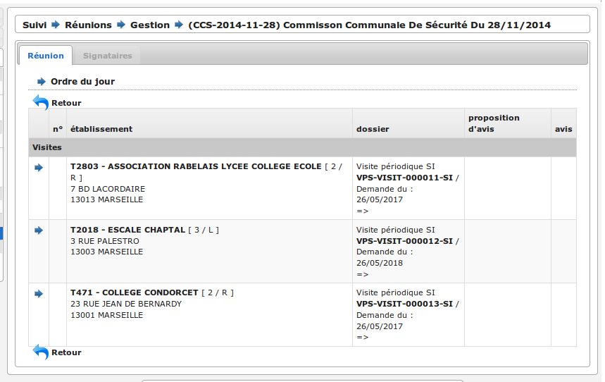

Planifier
#########

Cet écran présente un listing des dossiers pressentis, ce sont toutes les demandes de passage qui n'ont été planifiées à aucune réunion mais dont le type correspond au type de la réunion sur laquelle on se trouve. Des cases à cocher permettent de sélectionner les demandes de passage que l'on souhaite planifier/ajouter à l'ordre du jour. En cliquant sur le bouton de validation, le traitement est effectué sauf si la demande de passage n'est plus disponible. Dans les deux cas un message indique à l'utilisateur le résultat du traitement. Cette action est disponible seulement si la réunion n'a pas déjà été clôturée.

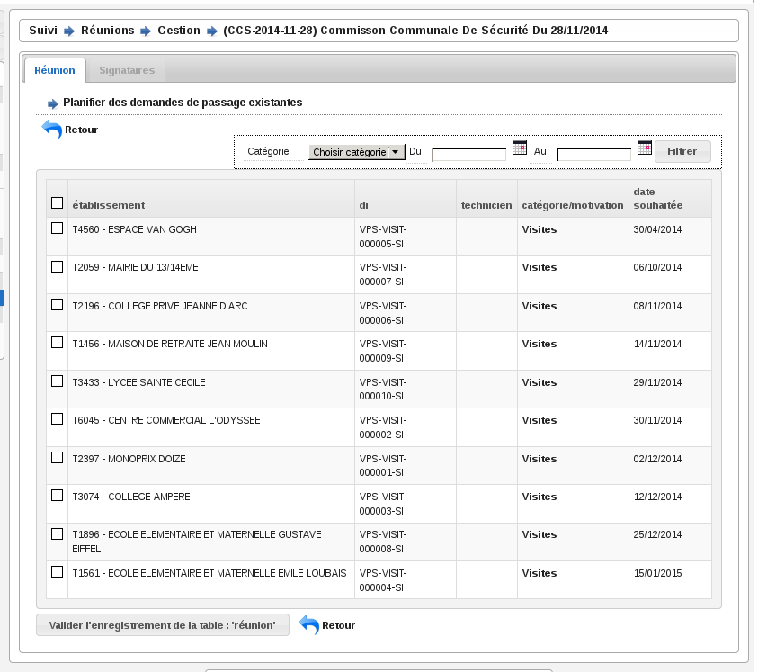

Pour aider à la saisie des dossiers à planifier, une action permet de sélectionner tous les éléments du listing (cocher toutes les cases à cocher) en un seul clic et un formulaire de recherche permet de filtrer le listing sur :

- une période pour la date souhaitée (du ... au ...),
- la catégorie.

Déplanifier
###########

Cet écran présente un listing des demandes de passage qui ont été planifiées pour la réunion sur laquelle on se trouve. Des cases à cocher permettent de sélectionner les demandes de passage que l'on souhaite retirer de l'ordre du jour. En cliquant sur le bouton de validation, le traitement est effectué sauf si un retour d'avis est déjà saisi dans la demande de passage. Dans les deux cas un message indique à l'utilisateur le résultat du traitement. Pour aider à la saisie des dossiers à déplanifier, une action permet de sélectionner tous les éléments du listing (cocher toutes les cases à cocher) en un seul clic. Cette action est disponible seulement si la réunion n'a pas déjà été clôturée.

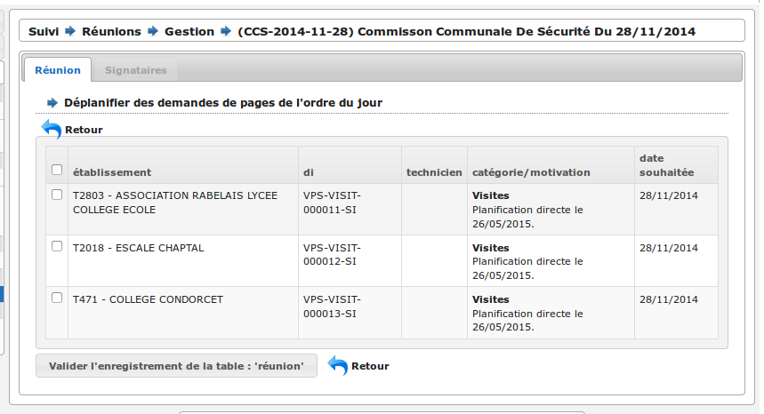

Planifier nouveau
#################

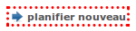

Cet écran permet de planifier directement un ou des dossiers d'instruction à la réunion sur laquelle on se trouve sans créer manuellement au préalable une demande de passage sur le ou les dossiers d'instruction concernés. Cette action est disponible seulement si la réunion n'a pas déjà été clôturée.

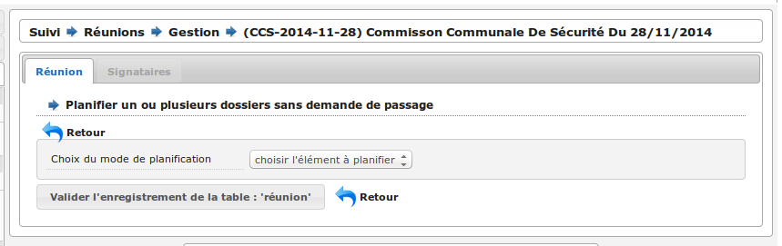

Trois choix de planification directe sont possibles : 

- programmation : planifie tous les dossiers d'instruction correspondant aux visites présente dans une programmation. Il suffit de sélectionner : la programmation (parmi la liste des programmations passées qui n'ont pas déjà été planifiées pour une autre réunion) et la catégorie (dans laquelle on souhaite insérer ces demandes de passage).

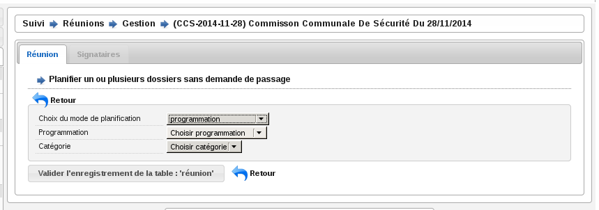

- réunion : planifie tous les dossiers d'instruction présents dans une réunion. Il suffit de sélectionner : la réunion (parmi la liste des réunions clôturées qui ne sont pas des réunions de commission et qui n'ont pas déjà été planifiées pour une autre réunion) et la catégorie (dans laquelle on souhaite insérer ces demandes de passage).

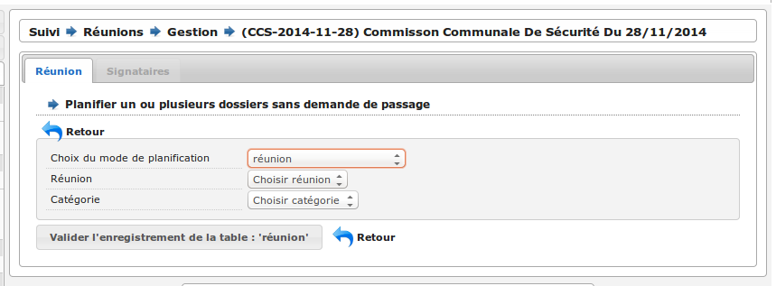

- dossier : planifie le dossier d'instruction correspondant au code du dossier de coordination ou du dossier d'instruction saisi. Il suffit de saisir le code du dossier de de sélectionner la catégorie (dans laquelle on souhaite insérer cette demande de passage).

.. image :: reunions-action-planifier-nouveau-view-dossier.png

Numéroter
#########

Cette action permet de déclencher la numérotation de l'ordre du jour, c'est-à-dire numéroter la liste des demandes de passage planifiées à partir de 1. Une fois que la numérotation a été déclenchée, tout nouveau dossier prendra le numéro suivant. Un dossier retiré de l'ordre du jour laissera un vide dans la numérotation. La numérotation initiale se fait par catégorie selon l'ordre défini dans le paramétrage du type de réunion. Cette action est disponible que si la numérotation n'a pas déjà été effectuée.

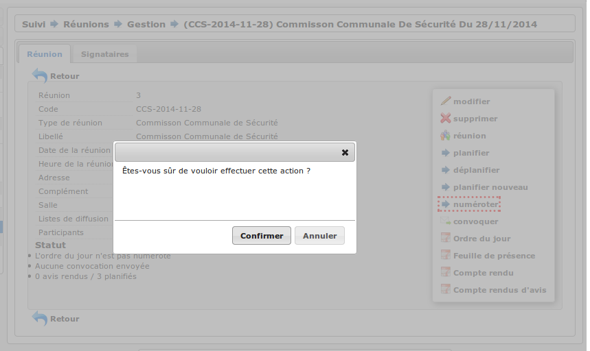

Imprimer l'ordre du jour
########################

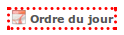

À tout moment une action permet d'accéder à l'ordre du jour au format PDF en cliquant sur l'action « Ordre du jour » dans l'écran de gestion de la réunion. 

Un modèle de document paramétrable dans le type de réunion sert de base pour l'ordre du jour de la réunion. Il sera composé de champs de fusion et rempli avec les informations de la réunion au moment de sa génération. Un champ de fusion particulier "avis proposé" provient de la demande de passage ou de l'analyse selon le cas.

L'ordre du jour est stocké pour mémoire lors de la clôture de la réunion.

Gérer les membres de la réunion
-------------------------------

Convoquer
#########

À tout moment une action permet de convoquer les instances de la réunion en cliquant sur l'action "Convoquer les membres" dans l'écran de gestion de la réunion. Cette action permet d'envoyer un mail aux différentes adresses paramétrées dans les instances, ainsi qu'aux adresses présentes dans le champ « liste de diffusion » de la réunion. Un écran permet de confirmer l'envoi du mail avec une case à cocher permettant d'indiquer si l'ordre du jour doit être envoyé ou non en pièce jointe. La date de dernière convocation est stockée pour mémoire.

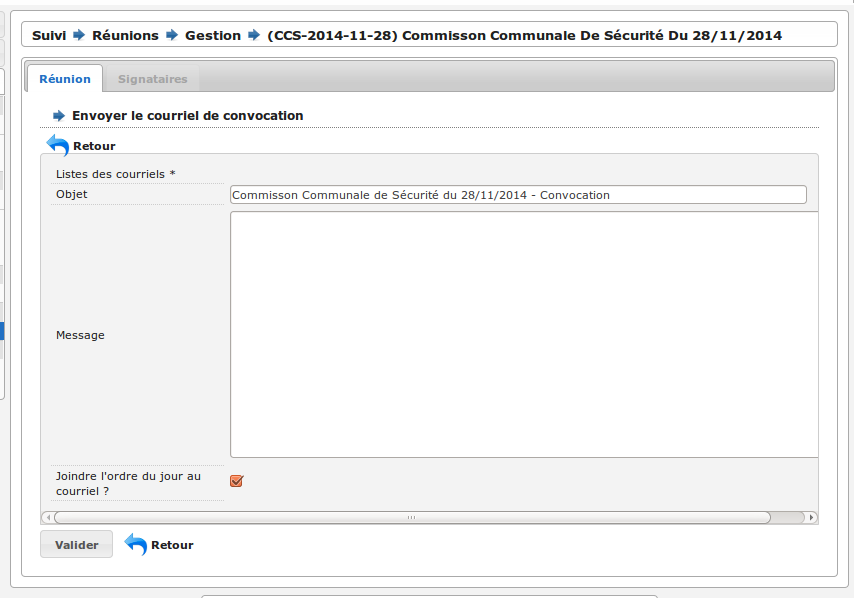

Feuille de présence
###################

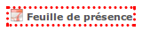

À tout moment une action permet d'accéder à la feuille de présence au format PDF en cliquant sur l'action « Feuille de présence » dans l'écran de gestion de la réunion. 

Un modèle de document paramétrable dans le type de réunion sert de base pour la feuille de présence de la réunion. Il sera composé de champs de fusion et rempli avec les informations de la réunion au moment de sa génération. 

Sélectionner les signataires
############################

Un écran permet, pour chaque instance de la réunion :

- de sélectionner le membre qui la représente,
- de saisir un texte libre.

L'unique objectif de ces informations est de remplir la feuille de présence.

Gérer les avis
--------------

Rendre l'avis
#############

Depuis l'écran de gestion d'une réunion, le listing des dossiers planifiés (l'ordre du jour) permet d'accéder à chaque formulaire de saisie du retour d'avis. Ce retour est composé des informations suivantes :

- proposition d'avis : lecture seule,
- proposition de complément d'avis (éventuellement second avis) : lecture seule,
- avis : sélection d'un avis dans la liste des avis,
- complément d'avis (éventuellement second avis) : ligne de texte,
- motivation de l'avis : texte.

Il est possible d'imprimer le compte-rendu d'avis depuis cet écran.

Dans cet écran une action permet d'insérer et de saisir des décisions d'autorité de police.

Dans certains cas, il n'y a pas de prise d'avis ou de décision sur un dossier lors d'une réunion. Dans ce cas un avis tel que 'A revoir' ou 'Différé' est saisi, qui permettra la suite du processus. Il est donc nécessaire de reprogrammer un passage pour le dossier en question. Dans le même écran de saisie, une action permet d'insérer et de saisir des demandes de passage en réunion. Le formulaire est identique au formulaire de demande de passage manuel. Il est ainsi possible d'indiquer la date souhaitée de passage, le type de réunion, la catégorie et éventuellement la proposition d'avis.

Imprimer le compte rendu d'avis
###############################

Un modèle de document paramétrable dans le type de réunion servira de base pour le compte-rendu par dossier. Il sera composé de champs de fusion et rempli avec les informations de la réunion au moment de sa génération.

Une action disponible depuis la fiche de visualisation d'une demande de passage permet d'imprimer le "compte-rendu par dossier" de la demande de passage.

Une action disponible sur la fiche de la réunion permet d'imprimer l'ensemble des "compte-rendus par dossier" de toutes les demandes de passage en une seule action.

Gérer le compte-rendu et la clôture de la réunion
-------------------------------------------------

Imprimer le compte rendu
########################

Un modèle de document paramétrable dans le type de réunion servira de base pour le compte-rendu global de la réunion. Il sera composé de champs de fusion et rempli avec les informations de la réunion au moment de sa génération.

À tout moment une action permet d'accéder au compte-rendu au format PDF en cliquant sur l'action "Compte-rendu" dans l'écran de gestion de la réunion. Ce compte-rendu global de la réunion est un listing de tous les dossiers avec l'avis résultant de la réunion.

Clôturer
########

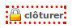

Une action permet de clôturer la réunion.

Restriction(s) :

- Si toutes les demandes de passage n'ont pas un avis, alors la clôture de la réunion n'est pas possible.
- Une fois la réunion clôturée alors il n'est plus possible de modifier les avis.
- Une fois la réunion clôturée alors il n'est plus possible de modifier l'ordre du jour (les actions/écrans permettant de le gérer disparaissent).

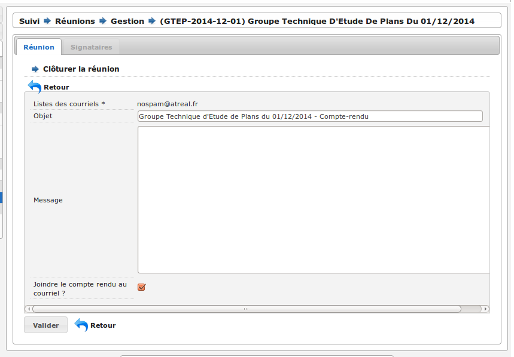

Cette action permet d'accéder à un formulaire de confirmation de la clôture de la réunion en donnant le choix à l'utilisateur de diffuser ou non par mail le compte-rendu global. Les actions sont :

- diffuser le compte-rendu par mail aux instances de la réunion (aux différentes adresses paramétrées dans les instances et dans le champ « liste de diffusion »),
- générer et finaliser le compte-rendu (stockage du document),
- générer et finaliser l'ordre du jour (stockage du document),
- noter la réunion comme clôturée.

Charger les fichiers numérisés
##############################

Cet écran permet de charger dans la réunion le "compte-rendu global" signé numérisé ainsi que le document rassemblant l'ensemble des "compte-rendus par dossier" signés numérisé. Cette action est disponible seulement une fois que la réunion est clôturée.

.. image:: reunions-action-integrer-documents-numerises-view.png

Supprimer une réunion
---------------------

Cet écran permet de supprimer la réunion. Cette action est disponible seulement si aucun dossier planifié à cette réunion n'a d'avis rendu.

Lors de la suppression, toutes les demandes de passages qui lui étaient affectées seront désaffectées et réapparaîtront dans le pool des demandes de passage pour être planifié à une autre réunion. 

